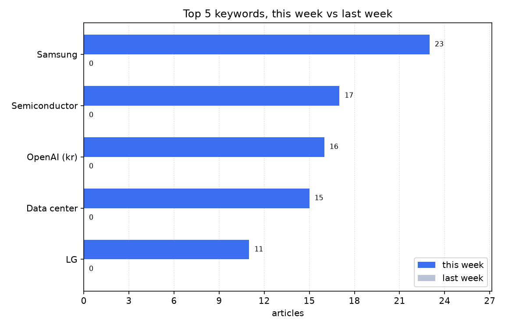

# 주간 AI 뉴스 리포트

대상 기간은 한국 시간으로 2026-09-07 월요일부터 2026-09-13 일요일까지다.
이번 주에 AI가 남긴 기사는 201건이다. 지난주는 수집 기록이 없어 견주지 않는다.
판단 기록이 없는 날이 4일 있다. 빈 날짜는 다음과 같다. 2026-09-07, 2026-09-08, 2026-09-10, 2026-09-11

## 이번 주에 새로 나온 도구

- 09-09 'HBF 표준 공개로 상용화 속도… HBM 후공정株 수혜 전망' 소식이 한 곳에서 나왔다 (대표 링크 https://www.newspim.com/news/view/20260810000843)
- 09-09 'HUG, 든든전세 매입심사에 AI 도입… 처리시간 93% 단축' 소식이 한 곳에서 나왔다 (대표 링크 https://biz.heraldcorp.com/article/10867696)
- 09-09 'LG CNS, 차움 건강검진센터 검진 전과정 AI 적용' 소식이 한 곳에서 나왔다 (대표 링크 https://biz.heraldcorp.com/article/10867640)
- 09-09 'LG이노텍, AI 가속기용 고성능 기판 FC' 소식이 한 곳에서 나왔다 (대표 링크 https://www.heraldk.com/article/2026090816551399313)
- 09-09 '내 인스타 보고 데이트 계획 짜준다… 메타, AI 비서 뮤즈 출시' 소식이 한 곳에서 나왔다 (대표 링크 https://www.segye.com/newsView/20260909504981)
- 09-09 '대한항공, AI 항공 기술 총출동… 제조 · 정비 · UAM 관제 공개' 소식이 한 곳에서 나왔다 (대표 링크 https://www.ddaily.co.kr/page/view/2026090911181228654)
- 09-09 '삼성 · LG, AI 가속기 겨냥 차세대 기판 공개' 소식이 한 곳에서 나왔다 (대표 링크 https://biz.heraldcorp.com/article/10867623)
- 09-09 '삼성서울병원, 16일 휴머노이드형 수술보조로봇 일반에 첫 공개' 소식이 한 곳에서 나왔다 (대표 링크 https://www.dongascience.com/ko/news/79850)
- 09-09 '삼성전기 · LG이노텍, KPCA쇼 서 AI용 대면적 · 유리기판 기술력 공개' 소식이 한 곳에서 나왔다 (대표 링크 https://zdnet.co.kr/view/?no=20260909110315)
- 09-09 '쇼핑 · 예매부터 현장학습 동의서까지… 메타, 개인형 AI 비서 뮤즈 공개' 소식이 한 곳에서 나왔다 (대표 링크 https://zdnet.co.kr/view/?no=20260909085750)
- 09-09 '에스트래픽, AI 기반 도시운영 컨트롤타워 공개' 소식이 한 곳에서 나왔다 (대표 링크 https://www.newspim.com/news/view/20260909000216)
- 09-09 '온라인 쇼핑 · 일정 예약도 척척… 메타, AI 에이전트 뮤즈 출시' 소식이 한 곳에서 나왔다 (대표 링크 https://zdnet.co.kr/view/?no=20260909083635)
- 09-09 '이메일 쓰고 쇼핑 결제까지… 메타, AI에이전트 뮤즈 출시' 소식이 한 곳에서 나왔다 (대표 링크 http://www.koreatimes.com/article/20260908/1628875)
- 09-09 '인간 유전자 변이 90억 개 영향 확인… 딥마인드 알파게놈 아틀라스 공개' 소식이 한 곳에서 나왔다 (대표 링크 https://www.dongascience.com/ko/news/79851)
- 09-09 '토마토시스템, AI 기반 개발 플랫폼 엑스빌더6 아이젠 공개' 소식이 한 곳에서 나왔다 (대표 링크 https://www.newspim.com/news/view/20260909000237)
- 09-13 '서울 도심서 끼어들기 · 비보호 좌회전 대응... 현대차 아트리아 AI 첫 공개' 소식이 한 곳에서 나왔다 (대표 링크 https://www.insight.co.kr/news/573237)
- 09-13 '한화오션, AI 데이터센터 바다로 옮긴다60MW급 FDC 공개' 소식이 한 곳에서 나왔다 (대표 링크 https://newsway.co.kr/news/view?ud=2026091313222871922)

## 규제와 정책

- 09-09 'AI 속도전에 국회도 뛴다… 최태원 입법도 혁신에 발맞춰야' 소식이 한 곳에서 나왔다 (대표 링크 https://zdnet.co.kr/view/?no=20260909112908)
- 09-09 '美정부, 정상회담 앞두고 中 AI 기업들이 무단 복제 비판' 소식이 한 곳에서 나왔다 (대표 링크 https://www.fnnews.com/news/202609091128058332)
- 09-09 '지방정부 AI 혁신 한자리에… 재난전파 10분→10초로 단축' 소식이 한 곳에서 나왔다 (대표 링크 https://www.newspim.com/news/view/20260909000207)
- 09-09 AI 데이터센터 특별법 내년 3월 시행… 정부, 인허가 · 전력 특례 구체화한다고 한 곳이 전했다 (대표 링크 https://zdnet.co.kr/view/?no=20260909092327)
- 09-09 AI 스타트업 핵심인력 통째 영입 도 기업결합 신고… 공정위 사각지대 막는다고 한 곳이 전했다 (대표 링크 https://www.newspim.com/news/view/20260909000573)
- 09-12 '위험한 AI는 출시 못 한다 美 상원, 연방정부 차단권 추진' 소식이 한 곳에서 나왔다 (대표 링크 https://www.edaily.co.kr/News/Read?newsId=02384566645579464&mediaCodeNo=257)
- 09-12 '캘리포니아, 아동 AI규제법 제정… 위험 감지되면 부모 알려야' 소식이 한 곳에서 나왔다 (대표 링크 http://www.koreatimes.com/article/20260911/1629400)
- 09-13 '美 규제에도… 현대차 BD 출신 설립 美 로봇업체, 중국산 몸체 추진' 소식이 한 곳에서 나왔다 (대표 링크 https://www.edaily.co.kr/News/Read?newsId=02240246645579792&mediaCodeNo=257)
- 09-13 '빅테크 성지 美 캘리포니아도, AI · SNS 규제법 애덤법 제정' 소식이 한 곳에서 나왔다 (대표 링크 https://www.hankookilbo.com/news/article/A2026091310580004334)

## 많이 나온 키워드

| 키워드 | 이번 주 |
| --- | ---: |
| 삼성 | 23 |
| 반도체 | 17 |
| 오픈AI | 16 |
| 데이터센터 | 15 |
| LG | 11 |

이번 주에 가장 많이 나온 키워드는 삼성으로 23건이다.
지난주는 수집 기록이 없어 늘고 줄어든 것은 적지 않는다.

## 차트

## 사람 코멘트

아래 인용 블록은 비워 둔다. 리포트를 읽고 직접 채운다.

>
>

## 한계

GDELT 는 색인해 둔 매체만 훑는다. 국내 매체 가운데 빠진 곳이 있어서, 여기 없는 기사가 실제로 없었다는 뜻은 아니다.
한 번에 받아 오는 기사는 250건이 상한이다. 상한에 걸린 구간은 시간을 쪼개 다시 받지만, 쪼갠 경계에서 빠지는 기사가 있을 수 있다.
분류와 묶기는 제목만 보고 한다. 본문을 읽지 않으니 제목이 모호한 기사는 엉뚱한 묶음에 들어가기도 한다.
키워드 건수는 제목에 그 말이 들어갔는지로 센다. 한 기사가 키워드 여러 개에 겹쳐 잡히므로 표의 숫자를 다 더해도 기사 수와 맞지 않는다.
표에 오른 기사 가운데 몇 건은 대표 링크를 눌러 원본 제목과 날짜를 직접 맞춰 본 뒤 코멘트에 적는다.

## 출처

자료는 GDELT DOC 2.0 에서 받았고 하루 경계는 한국 시간으로 끊었다. 집계한 날짜는 2026-09-07 부터 2026-09-13 까지다. 검색어는 ("artificial intelligence" OR OpenAI) sourcelang:korean 이다. 제목과 링크, 매체, 시각만 들어오기 때문에 본문은 읽지 않고 제목만 보고 골랐다.
