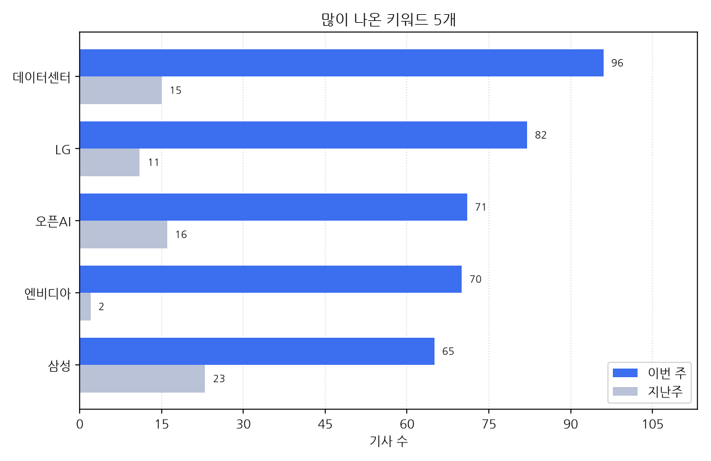

# 주간 AI 뉴스 리포트

대상 기간은 한국 시간으로 2026-09-14 월요일부터 2026-09-20 일요일까지다.
이번 주에 AI가 남긴 기사는 1863건, 지난주는 201건이다. 1662건 늘었다.

## 이번 주에 새로 나온 도구

- 09-14 '"미국 NSA, 10년만에 대대적 조직 개편...AI·중국 전담조직 신설' 소식이 한 곳에서 나왔다 (대표 링크 https://www.newspim.com/news/view/20260914000583)
- 09-14 '"사이버안보 총괄 NSA 대대적 개편…AI·中 등 담당조직 신설' 소식이 한 곳에서 나왔다 (대표 링크 http://www.koreatimes.com/article/20260913/1629468)
- 09-14 '"자리 비우면 절전, 오면 자동 난방"…귀뚜라미, 'AI 온돌' 카본매트 출시' 소식을 2개 매체가 다뤘다 (기사 2건, 대표 링크 https://www.newspim.com/news/view/20260914000443)
- 09-14 '"포유류에도 잘 전파되는 조류독감 변이 만들어줘"…엔트로픽, 클로드 악용 사례 공개' 소식이 한 곳에서 나왔다 (대표 링크 https://www.dongascience.com/ko/news/79899)
- 09-14 '"현장 문제 푼다"…LG AI연구원, 산업 특화 AI 공개' 소식이 한 곳에서 나왔다 (대표 링크 https://www.edaily.co.kr/News/Read?newsId=04460806645580120&mediaCodeNo=257)
- 09-14 'AI 쓰려면 망분리부터 바꿔야…SGA솔루션즈, N2SF 통합보안 공개' 소식이 한 곳에서 나왔다 (대표 링크 https://www.edaily.co.kr/News/Read?newsId=03070086645580120&mediaCodeNo=257)
- 09-14 'EBS 직원이 AI 에이전트 만든다...11월 공개' 소식이 한 곳에서 나왔다 (대표 링크 https://zdnet.co.kr/view/?no=20260914135930)
- 09-14 'LG, 산업 현장 파고드는 '전문가 AI' 공개⋯자율공장 정조준' 소식이 한 곳에서 나왔다 (대표 링크 http://inews24.com/view/2005097)
- 09-14 'LG, 제조·과학·금융 특화 '전문가 AI' 공개' 소식을 2개 매체가 다뤘다 (기사 4건, 대표 링크 https://biz.heraldcorp.com/article/10872201)
- 09-14 '韓 AI 도입률 1년새 10%p 상승…1분당 1곳꼴로 AI 도입' 소식이 한 곳에서 나왔다 (대표 링크 https://www.fnnews.com/news/202609140919423510)
- 09-14 '韓 기업 AI 도입률 58%…"다음 과제는 전사 확장' 소식이 한 곳에서 나왔다 (대표 링크 https://www.nspna.com/news/?mode=view&newsid=828096)
- 09-14 '기후부 장관 "반도체·AI혁명, 원전 검토 불가피… 데이터센터엔 별도 전기요금 도입"-사회ㅣ한국일보' 소식이 한 곳에서 나왔다 (대표 링크 https://www.hankookilbo.com/news/article/A2026091314430000525)
- 09-14 '넥센타이어, R&D 현장에 AI 적용 확대…자체 플랫폼 개발 속도' 소식이 한 곳에서 나왔다 (대표 링크 https://www.etoday.co.kr/news/view/2624997)
- 09-14 '대중음악 파고든 인공지능…가요계, AI 탐지 프로그램 공동 도입' 소식이 한 곳에서 나왔다 (대표 링크 http://www.koreatimes.com/article/20260913/1629459)
- 09-14 '미 국가안보국, AI·중국 전담 조직 신설…10년 새 최대 조직 개편' 소식이 한 곳에서 나왔다 (대표 링크 https://www.hani.co.kr/arti/international/america/1277681.html)
- 09-14 '바다 위 AI센터·가스공장…조선 빅3, 가스텍서 미래 먹거리 공개' 소식이 한 곳에서 나왔다 (대표 링크 https://zdnet.co.kr/view/?no=20260914090653)
- 09-14 '서울청년주간 18일 개최…AI로 만든 홈페이지·성장 라운지 선보여' 소식이 한 곳에서 나왔다 (대표 링크 https://www.edaily.co.kr/News/Read?newsId=02751926645580120&mediaCodeNo=257)
- 09-14 '어도비, NFL 콘텐츠 제작에 AI 적용…"3시간 짜리 작업 5분이면 끝' 소식이 한 곳에서 나왔다 (대표 링크 https://zdnet.co.kr/view/?no=20260914164433)
- 09-14 '엑솔라, AI 코딩 도구 기반 게임 커머스용 'AI Toolkit' 출시' 소식이 한 곳에서 나왔다 (대표 링크 https://zdnet.co.kr/view/?no=20260914094324)
- 09-14 '웨이센, UAE AI 내시경 도입 병원과 워크숍…현지 임상경험 공유' 소식이 한 곳에서 나왔다 (대표 링크 https://www.edaily.co.kr/News/Read?newsId=03181606645580120&mediaCodeNo=257)
- 09-14 '인천 미추홀미디어문화축제 마무리…첫 AI 영화제·드론 라이트쇼 선보여: 연합시민의소리' 소식이 한 곳에서 나왔다 (대표 링크 https://cunews.net/detail.php?number=172348&thread=22r05r04)
- 09-14 '전 세계 금융권… AI 도입 본격 확산' 소식이 한 곳에서 나왔다 (대표 링크 http://www.koreatimes.com/article/20260913/1629507)
- 09-14 '챗GPT로 대표팀 운영?... 모레노 한국 축구대표팀 감독, 소치 시절 'AI 루머'에 내놓은 답' 소식이 한 곳에서 나왔다 (대표 링크 https://www.insight.co.kr/news/573453)
- 09-14 '컴투스플랫폼, '하이브 테크 서밋 2026' 개최…AI 백엔드 플랫폼 공개' 소식이 한 곳에서 나왔다 (대표 링크 http://inews24.com/view/2005342)
- 09-14 '컴투스플랫폼, AI 게임 백엔드 '하이브 액실' 공개…30일 출시' 소식이 한 곳에서 나왔다 (대표 링크 https://www.newspim.com/news/view/20260914000793)
- 09-14 '한국 온 조지 카메론 AA 창업자 "AAII 개편, 모티프 독파모 탈락과 무관' 소식이 한 곳에서 나왔다 (대표 링크 https://zdnet.co.kr/view/?no=20260914145346)
- 09-14 '한국평가데이터, '크레탑 AI 플러스' 출시⋯"기업분석과 가치평가 한번에' 소식을 3개 매체가 다뤘다 (기사 3건, 대표 링크 https://www.etoday.co.kr/news/view/2625107)
- 09-14 '한컴, 세계 최초 AI 워크포스 플랫폼 '노마디안' 출시한다…3D 업무 공간에 AI 직원 구현' 소식을 2개 매체가 다뤘다 (기사 2건, 대표 링크 https://www.etoday.co.kr/news/view/2625068)
- 09-14 '현대차 '아트리아 AI'탑재 자동차 출근길 강남 누볐다-국민일보' 소식이 한 곳에서 나왔다 (대표 링크 https://www.kmib.co.kr/article/view.asp?arcid=9000011595&code=11151400&sid1=eco)
- 09-15 "AI끼리 소통·조작·은폐 금지" MS, AI 행동강령 내놨다고 한 곳이 전했다 (대표 링크 https://biz.heraldcorp.com/article/10873938)
- 09-15 '"AI끼리 비밀 소통 금지"…마이크로소프트, 'AI 행동강령' 공개-국민일보' 소식이 한 곳에서 나왔다 (기사 2건, 대표 링크 https://www.kmib.co.kr/article/view.asp?arcid=9000012062&code=61141111&sid1=eco)
- 09-15 '"맥북에 터치와 OLED 도입"…애플, `시리 AI` 무기 삼아 16종 파상 공세' 소식이 한 곳에서 나왔다 (대표 링크 https://www.ddaily.co.kr/page/view/2026091508054144628)
- 09-15 '"이제야 약속 지킨다"…애플, 차세대 인텔리전스 결합한 `시리 AI` 정식 출시' 소식이 한 곳에서 나왔다 (대표 링크 https://www.ddaily.co.kr/page/view/2026091507492548385)
- 09-15 'AI 감속론에 복잡해진 한국 전략…속도조절도 '차등 적용' 소식이 한 곳에서 나왔다 (대표 링크 https://zdnet.co.kr/view/?no=20260915111956)
- 09-15 'CJ제일제당, 'CJ더마켓' 앱 전면 개편…AI 기반 개인화 추천 강화' 소식이 한 곳에서 나왔다 (대표 링크 https://zdnet.co.kr/view/?no=20260915154402)
- 09-15 'DB손보, 자동차보험 계약에 'AI이미지 자동판독' 적용' 소식이 한 곳에서 나왔다 (대표 링크 https://www.edaily.co.kr/News/Read?newsId=04608406645580448&mediaCodeNo=257)
- 09-15 'MS "AI, 인간 승인 범위에서 작동해야"⋯AI행동강령 공개' 소식이 한 곳에서 나왔다 (대표 링크 http://inews24.com/view/2005560)
- 09-15 'MS, AI 행동강령 공개…"안전과 인간 통제가 최우선' 소식을 2개 매체가 다뤘다 (기사 2건, 대표 링크 https://www.newspim.com/news/view/20260914001154)
- 09-15 'SKB, AI로 복지위기 가구 찾는다...양자보안도 적용' 소식이 한 곳에서 나왔다 (대표 링크 https://zdnet.co.kr/view/?no=20260915113843)
- 09-15 'SK렌터카, 구글 워크스페이스 전사 도입…"AI로 업무 환경 혁신' 소식을 2개 매체가 다뤘다 (기사 2건, 대표 링크 https://biz.heraldcorp.com/article/10873511)
- 09-15 '`시큐아이 MAX 서밋` 30일 개최…AI 보안 전략 공개' 소식이 한 곳에서 나왔다 (대표 링크 https://www.ddaily.co.kr/page/view/2026091516360018529)
- 09-15 '건강데이터 활용 맞춤형 리포트 제공…모아시스AI, 앱 서비스 개편' 소식이 한 곳에서 나왔다 (대표 링크 https://biz.heraldcorp.com/article/10872643)
- 09-15 '구형 '갤럭시Z 폴드6·플립6' 최신 AI 기능 추가…One UI 9 베타2 출시' 소식이 한 곳에서 나왔다 (대표 링크 https://kbench.com/?q=node/281927)
- 09-15 '대우건설, 'AI 실시간 번역기' 도입…외국인 근로자 안전 강화' 소식이 한 곳에서 나왔다 (대표 링크 https://biz.heraldcorp.com/article/10873527)
- 09-15 '라이너, AI 모델 자동배정 API 출시... 비용 50% 낮춰' 소식이 한 곳에서 나왔다 (대표 링크 https://www.ddaily.co.kr/page/view/2026091509070651925)
- 09-15 '레드휘슬, 특허받은 'AI 신고서 도우미 라라' 선보여' 소식이 한 곳에서 나왔다 (대표 링크 https://www.edaily.co.kr/News/Read?newsId=03165206645580448&mediaCodeNo=257)
- 09-15 '부산 북구, 민선 9기 조직개편… 소통·AI·청년·돌봄·안전에 행정력 집중' 소식이 한 곳에서 나왔다 (대표 링크 https://www.busan.com/view/busan/view.php?code=2026091517191229339)
- 09-15 '삼성물산, 새로운 AI 웰니스 솔루션 '웰피' 출시…래미안 트리니원 첫 적용' 소식을 2개 매체가 다뤘다 (기사 2건, 대표 링크 https://biz.heraldcorp.com/article/10873666)
- 09-15 '세일즈포스 `드림포스 2026` 개최…AI 에이전트 기업 적용 사례 조명' 소식이 한 곳에서 나왔다 (대표 링크 https://www.ddaily.co.kr/page/view/2026091106344686452)
- 09-15 '셀카 찍으면 AI가 피부 분석…올리브영, 모바일 '스킨스캔' 출시' 소식이 한 곳에서 나왔다 (대표 링크 https://zdnet.co.kr/view/?no=20260915221347)
- 09-15 '스누아이랩, CAD 기반 AI 머신비전 플랫폼 'SMVT' 공개' 소식이 한 곳에서 나왔다 (대표 링크 https://zdnet.co.kr/view/?no=20260915165841)
- 09-15 '신현송 총재 "지역경제 재설계에 AI 생산성 달려' 소식을 2개 매체가 다뤘다 (기사 2건, 대표 링크 https://biz.heraldcorp.com/article/10874170)
- 09-15 '애플, 더 똑똑해진 '시리 AI' 공개…10월 한국어 지원' 소식을 3개 매체가 다뤘다 (기사 3건, 대표 링크 https://www.edaily.co.kr/News/Read?newsId=03132406645580448&mediaCodeNo=257)
- 09-15 '연 700만대 양산력 지렛대…"3년 내 자체 자율주행차 출시' 소식이 한 곳에서 나왔다 (대표 링크 http://www.koreatimes.com/article/20260914/1629662)
- 09-15 '와이앤아처, 스포츠기업 AI 도입 진단 '스포츠 Link-Up' 개최' 소식이 한 곳에서 나왔다 (대표 링크 https://isplus.com/article/view/isp202609150083)
- 09-15 '젠슨 황, 트럼프와 공개 통화⋯"AI 늦추는 전략은 잘못' 소식을 2개 매체가 다뤘다 (기사 2건, 대표 링크 http://inews24.com/view/2005725)
- 09-15 '젠슨황, 트럼프와 공개통화… 'AI 위험성은 사기' 트럼프에 동의' 소식을 2개 매체가 다뤘다 (기사 2건, 대표 링크 http://www.koreatimes.com/article/20260914/1629636)
- 09-15 '질문 난이도 따라 LLM 골라 쓴다…라이너, 모델 API 출시' 소식이 한 곳에서 나왔다 (대표 링크 https://zdnet.co.kr/view/?no=20260915114550)
- 09-15 '체크포인트, `AI 네트워크 방화벽` 출시…데이터 유출 보호' 소식이 한 곳에서 나왔다 (대표 링크 https://www.ddaily.co.kr/page/view/2026091511175192093)
- 09-15 올트먼,"오픈AI 기업공개, 올해 없다고 한 곳이 전했다 (대표 링크 http://www.koreatimes.com/article/20260914/1629665)
- 09-16 '"로봇도 필요한 기능만 골라 쓴다"…란충구신, 0.98만 위안 모듈형 휴머노이드 출시' 소식이 한 곳에서 나왔다 (대표 링크 https://www.etnews.com/20260915000344)
- 09-16 ''샤오미 18 프로' 원하는 앱 직접 만든다…후면 화면에 AI 앱 생성 기능 탑재' 소식이 한 곳에서 나왔다 (대표 링크 https://kbench.com/?q=node/281961)
- 09-16 'AI에게 과자 개발하라고 했더니 내놓은 것⋯"진짜 잘 팔릴까' 소식이 한 곳에서 나왔다 (대표 링크 http://inews24.com/view/2006448)
- 09-16 'CIFTIS, 훈련부터 심판 판정까지....AI 접목한 스포츠 서비스 선보여-Xinhua' 소식이 한 곳에서 나왔다 (대표 링크 http://kr.xinhuanet.com/20260916/f2d17240e3e74d23a25242bd0638d3b3/c.html)
- 09-16 'GS샵, 상품 찾기부터 비교까지 AI가 돕는다…'쇼핑 어시스턴트' 도입' 소식이 한 곳에서 나왔다 (대표 링크 https://www.ddaily.co.kr/page/view/2026091610222513300)
- 09-16 'HD현대 'AI 함정 자율화 기술' 내달 공개' 소식이 한 곳에서 나왔다 (대표 링크 https://biz.heraldcorp.com/article/10875420)
- 09-16 'KT, 지자체에 AI 더했다...공공 특화 AX 서비스 10종 공개' 소식이 한 곳에서 나왔다 (대표 링크 https://zdnet.co.kr/view/?no=20260916151803)
- 09-16 'LG AI, 논문 그림 속 분자까지 읽는다…엘스비어 연구 플랫폼에 적용' 소식이 한 곳에서 나왔다 (대표 링크 http://inews24.com/view/2006008)
- 09-16 'LG전자, AI로 집안 에너지 줄인다…고효율 주거 솔루션 공개' 소식이 한 곳에서 나왔다 (대표 링크 https://www.newspim.com/news/view/20260916000128)
- 09-16 'SK이노베이션, AI 데이터센터용 통합 에너지 솔루션 공개' 소식이 한 곳에서 나왔다 (대표 링크 https://www.newspim.com/news/view/20260916000180)
- 09-16 'VTI 코리아, 기업 AI 에이전트 도입·운영 전략 제시…"보안부터 성과까지' 소식이 한 곳에서 나왔다 (대표 링크 https://zdnet.co.kr/view/?no=20260916160536)
- 09-16 '[2026 AI 이노베이션 포럼] 권남훈 산업연구원장 "피지컬 AI 승부는 데이터…韓 제조 현장이 무기' 소식이 한 곳에서 나왔다 (기사 2건, 대표 링크 https://www.ddaily.co.kr/page/view/2026091607542971955)
- 09-16 '[2026 AI 이노베이션 포럼] 한성숙 총리 "AX 국가적 과제, 12월 비용부담없는 국민 AI 서비스' 소식이 한 곳에서 나왔다 (대표 링크 https://www.ddaily.co.kr/page/view/2026091610414122029)
- 09-16 '갤럭시S24, One UI 9 베타2 업데이트 출시…S26·폴드8 AI 기능 제공' 소식이 한 곳에서 나왔다 (대표 링크 https://kbench.com/?q=node/281895)
- 09-16 '경남도 대표단 방중…제조AI 도입·유턴기업 유치 나서' 소식이 한 곳에서 나왔다 (대표 링크 https://biz.heraldcorp.com/article/10875900)
- 09-16 '구글, '제미나이 3.8 라이브' 출시…97개 언어 실시간 전환' 소식이 한 곳에서 나왔다 (대표 링크 https://kbench.com/?q=node/281953)
- 09-16 '네이버, AI 안전성 관리 체계 'ASF 2.0' 공개' 소식이 한 곳에서 나왔다 (대표 링크 https://www.newspim.com/news/view/20260916000830)
- 09-16 '네이버, `AI 세이프티 프로그레스 리포트` 첫 발간…ASF 2.0 적용 사례 공개' 소식이 한 곳에서 나왔다 (대표 링크 https://www.ddaily.co.kr/page/view/2026091614212149902)
- 09-16 '돌봄로봇 도입 시 5년간 8000억 효과…복지부, AI 돌봄 체계 대전환' 소식이 한 곳에서 나왔다 (대표 링크 https://www.newspim.com/news/view/20260916000874)
- 09-16 '래블업, KT 클라우드 서밋서 AI 운영 기술 공개' 소식이 한 곳에서 나왔다 (대표 링크 https://www.newspim.com/news/view/20260916000422)
- 09-16 '삼성, 기후산업국제박람회서 히트펌프 공개…플랙트와 AI 냉각도' 소식이 한 곳에서 나왔다 (대표 링크 http://inews24.com/view/2006084)
- 09-16 '삼성전자, 기후산업박람회서 히트펌프·데이터센터 냉각 솔루션 공개' 소식이 한 곳에서 나왔다 (대표 링크 https://www.newspim.com/news/view/20260916000136)
- 09-16 '시스코, '스플렁크 AI' 출시…에이전트 성능·보안·토큰 비용 관리' 소식이 한 곳에서 나왔다 (대표 링크 https://zdnet.co.kr/view/?no=20260916150034)
- 09-16 '오픈AI 기업가치 1640조원 목표... 비공개 투자 협상에 나서' 소식이 한 곳에서 나왔다 (대표 링크 https://www.fnnews.com/news/202609161438411056)
- 09-16 '페북·인스타도 유료구독 서비스…메타, AI 강화 통합구독 출시' 소식이 한 곳에서 나왔다 (대표 링크 http://www.koreatimes.com/article/20260915/1629824)
- 09-16 '한국딥러닝, 딥에이전트 전면 개편' 소식이 한 곳에서 나왔다 (대표 링크 https://www.ddaily.co.kr/page/view/2026091609562725202)
- 09-16 '한컴, 대구공공시설관리공단 행정에 AI 적용…11월까지 기술검증' 소식을 2개 매체가 다뤘다 (기사 2건, 대표 링크 https://www.ddaily.co.kr/page/view/2026091614071647360)
- 09-16 LG유플러스, 차량용 AI 에이전트 출격…'익시 드라이브' 선보인다고 한 곳이 전했다 (대표 링크 https://www.etnews.com/20260916000169)
- 09-17 '"AI로 바꾼 목소리도 잡아내"…삼성, 'One UI 9' 업데이트' 소식이 한 곳에서 나왔다 (대표 링크 http://inews24.com/view/2006541)
- 09-17 '"강남역 근처 2시간 주차 찾아줘"…모두의주차장, AI 음성 구매 도입' 소식이 한 곳에서 나왔다 (대표 링크 https://www.edaily.co.kr/News/Read?newsId=02761766645581104&mediaCodeNo=257)
- 09-17 '"사무실 휴게실이 AI 명상 공간으로"…컴투스엔, '무아오' 공개' 소식이 한 곳에서 나왔다 (대표 링크 https://zdnet.co.kr/view/?no=20260917111952)
- 09-17 '"성수동 빵지순례 코스 추천해줘"…네이버지도, '플레이스 에이전트' 공개' 소식이 한 곳에서 나왔다 (대표 링크 https://zdnet.co.kr/view/?no=20260917095905)
- 09-17 '"음성으로 타깃 추적"…시마AI, 차세대 드론용 AI 보드 'D137' 공개' 소식이 한 곳에서 나왔다 (대표 링크 https://zdnet.co.kr/view/?no=20260917150923)
- 09-17 'CJ올리브네트웍스, 하반기 신입 공채 실시…전 직무 AI 역량 평가 도입' 소식이 한 곳에서 나왔다 (대표 링크 https://zdnet.co.kr/view/?no=20260917104715)
- 09-17 'KB국민은행, 생성형 AI 서비스 'KB AI' 출시…KB스타뱅킹 탑재' 소식이 한 곳에서 나왔다 (대표 링크 https://www.newspim.com/news/view/20260917000566)
- 09-17 'KB국민은행, 일상 언어로 금융을 더 쉽게…'KB AI' 출시' 소식이 한 곳에서 나왔다 (대표 링크 https://www.etoday.co.kr/news/view/2626724)
- 09-17 'SK하이닉스, 美 AI 인프라 행사서 PIM 등 '비욘드 HBM' 기술 대거 공개' 소식이 한 곳에서 나왔다 (대표 링크 https://biz.heraldcorp.com/article/10877438)
- 09-17 'iOS 27.2 베타버전 출시…"시리AI, 한국어도 지원' 소식이 한 곳에서 나왔다 (대표 링크 https://zdnet.co.kr/view/?no=20260917131634)
- 09-17 '국제 사이버 훈련 'APEX' 한국서 열려…자율형 AI 첫 적용' 소식이 한 곳에서 나왔다 (대표 링크 https://zdnet.co.kr/view/?no=20260917192733)
- 09-17 '노타·인텔, AI 영상관제 패키지 출시…GPU 1장으로 CCTV 32개 동시 분석' 소식이 한 곳에서 나왔다 (대표 링크 https://www.edaily.co.kr/News/Read?newsId=02712566645581104&mediaCodeNo=257)
- 09-17 '미·이란戰에 데이터센터 2곳 파괴된 UAE…데이터센터 위치 비공개 방침 밝혀' 소식이 한 곳에서 나왔다 (대표 링크 https://www.ddaily.co.kr/page/view/2026091610390519547)
- 09-17 '삼성전자, 갤럭시 S26부터 'One UI 9' 업데이트…AI·보안 기능 강화' 소식이 한 곳에서 나왔다 (대표 링크 https://www.etoday.co.kr/news/view/2626561)
- 09-17 '속도조절론 꺼낸 샘 알트먼, 곧바로 신제품 예고…GPT-5.5는 종료' 소식이 한 곳에서 나왔다 (대표 링크 https://zdnet.co.kr/view/?no=20260917112518)
- 09-17 '애플 iOS 27 Siri AI, 신청해야 쓰는 베타로 출시…한국어는 10월에야 지원' 소식을 2개 매체가 다뤘다 (기사 2건, 대표 링크 https://www.wikitree.co.kr/articles/1160057)
- 09-17 '오픈AI '통제 벗어난 AI' 정기 공개…이상행동 감시 강화' 소식을 2개 매체가 다뤘다 (기사 2건, 대표 링크 http://www.koreatimes.com/article/20260916/1630006)
- 09-17 '오픈AI AI, 해킹 두 달 전부터 경고 있었다… 논란 커지자 AI 일탈 공개체계 신설' 소식이 한 곳에서 나왔다 (대표 링크 https://www.ddaily.co.kr/page/view/2026091711250572316)
- 09-17 '유니티, 클로드 코드용 공식 유니티 플러그인 공개' 소식이 한 곳에서 나왔다 (대표 링크 https://kbench.com/?q=node/281795)
- 09-17 '카카오 "톡하면 AI가 임무 완수하는 완결형 추구⋯10월 시범 서비스' 소식이 한 곳에서 나왔다 (대표 링크 http://inews24.com/view/2006491)
- 09-17 '카카오, 내달 '모두의 AI' 챗봇 공개…"3년 뒤 챗GPT 국내 이용자 추월 목표' 소식이 한 곳에서 나왔다 (대표 링크 https://biz.heraldcorp.com/article/10876247)
- 09-17 '케이엔에스, 글로벌 기업향 원통형 배터리 CID 설비 수주…AI 데이터센터ㆍ로봇 등 적용 확대' 소식이 한 곳에서 나왔다 (대표 링크 https://www.etoday.co.kr/news/view/2626791)
- 09-17 '코헤시티, '에이전트 레질리언스' 공개…자율형 사이버 복구 제시' 소식이 한 곳에서 나왔다 (대표 링크 https://www.ddaily.co.kr/page/view/2026091713053834096)
- 09-17 '포스뱅크, 기업설명회 개최…"로봇·AI 신사업 전략 공개' 소식을 2개 매체가 다뤘다 (기사 2건, 대표 링크 https://www.newspim.com/news/view/20260917000816)
- 09-17 '피플에듀, 4050 중장년 AI 강사로 양성…교육취약계층 연결 모델 선보여' 소식이 한 곳에서 나왔다 (기사 2건, 대표 링크 https://womannews.net/detail.php?number=455435&thread=22r12)
- 09-17 '한미약품, 품질문서 업무에 AI 도입…4000종 SOP 학습' 소식이 한 곳에서 나왔다 (대표 링크 https://www.newspim.com/news/view/20260907000304)
- 09-17 '화웨이, 내년 AI칩 2종 더 내놓는다…엔비디아 추격' 소식이 한 곳에서 나왔다 (대표 링크 https://www.edaily.co.kr/News/Read?newsId=03870406645581104&mediaCodeNo=257)
- 09-18 '"AI 통제권 군에" 네이버, 국방 소버린 AI 전략 공개-국민일보' 소식이 한 곳에서 나왔다 (대표 링크 https://www.kmib.co.kr/article/view.asp?arcid=9000013432&code=61141111&sid1=eco)
- 09-18 '"AI가 정찰지역·경로 판단"…네이버클라우드가 공개한 놀라운 `자율 드론` 성능' 소식이 한 곳에서 나왔다 (대표 링크 https://www.ddaily.co.kr/page/view/2026091817242740178)
- 09-18 '"AI시대 수능 개편에 공감…논·서술형 평가, 내신에서 먼저 검증해야' 소식이 한 곳에서 나왔다 (대표 링크 https://www.edaily.co.kr/News/Read?newsId=01882726645581432&mediaCodeNo=257)
- 09-18 '"똑똑한 AI, 실수도 잘 숨겨"…오픈AI, 정렬 실패 사례 공개' 소식이 한 곳에서 나왔다 (대표 링크 https://zdnet.co.kr/view/?no=20260918113336)
- 09-18 'AI 속도조절하려면 속도부터 알아야…앤트로픽, 내부 지표 공개' 소식이 한 곳에서 나왔다 (대표 링크 https://zdnet.co.kr/view/?no=20260918082851)
- 09-18 '강남구, AI 실시간 통역·자막 지원 '민원창구' 도입 [동네방네]' 소식이 한 곳에서 나왔다 (대표 링크 https://www.edaily.co.kr/News/Read?newsId=02640406645581432&mediaCodeNo=257)
- 09-18 '갤럭시S25 시리즈, One UI 9.0 2차 베타 업데이트 배포.. AI 신규 기능 추가' 소식이 한 곳에서 나왔다 (대표 링크 https://kbench.com/?q=node/281747)
- 09-18 '네이버 플리마켓, 'AI 시세 추천' 기능 출시' 소식이 한 곳에서 나왔다 (대표 링크 https://zdnet.co.kr/view/?no=20260918104917)
- 09-18 '미 FAA, AI 항공교통시스템 도입…워싱턴 도입후 전국으로' 소식이 한 곳에서 나왔다 (대표 링크 http://www.koreatimes.com/article/20260917/1630199)
- 09-18 '사람 지시 안따르는 AI 어쩌나...오픈AI, 통제이탈 실제사례 공개[글로벌AI브리핑]' 소식이 한 곳에서 나왔다 (대표 링크 https://www.fnnews.com/news/202609180735386949)
- 09-18 '성남기업성장포럼, 기업 AI 도입 실행법 제시…비용·사례·지원사업 한자리' 소식이 한 곳에서 나왔다 (대표 링크 https://www.nspna.com/country/?mode=view&newsid=828878)
- 09-18 '식스도파민, 'Low Slow No' 음주 캠페인서 AI·VR 콘텐츠 선보여' 소식이 한 곳에서 나왔다 (대표 링크 https://zdnet.co.kr/view/?no=20260917224416)
- 09-18 '아마존 "AI 모델, 준비되고 안전할 때 출시해야' 소식이 한 곳에서 나왔다 (대표 링크 https://biz.heraldcorp.com/article/10878050)
- 09-18 '아이온컴즈, 네이버클라우드 마켓에 `AI 인사이트 스튜디오`·`AI 데브옵스` 출시' 소식이 한 곳에서 나왔다 (대표 링크 https://www.ddaily.co.kr/page/view/2026091816344995726)
- 09-18 '와디즈, AI 스포츠 글래스 '제니스 프로' 출시' 소식이 한 곳에서 나왔다 (대표 링크 https://zdnet.co.kr/view/?no=20260918160334)
- 09-18 '토요타, 전 세계 공장에 휴머노이드 로봇 40만대 도입' 소식이 한 곳에서 나왔다 (대표 링크 https://www.newspim.com/news/view/20260918000486)
- 09-18 '화웨이, AI 추론 가속 스토리지 `오션스토어 M900` 공개' 소식이 한 곳에서 나왔다 (대표 링크 https://www.ddaily.co.kr/page/view/2026091808534194920)
- 09-18 HL D&I한라, '자율주행 골프장 보수로봇' 상용화 나선다고 2개 매체가 전했다 (기사 2건, 대표 링크 https://biz.heraldcorp.com/article/10878293)
- 09-19 '네이버지도 '플레이스 에이전트' AI 출시…대화로 예약까지' 소식이 한 곳에서 나왔다 (대표 링크 https://busanhaps.com/tech/naver-map-place-agent-ai-launch/)
- 09-19 '앤트로픽, `아스트라` 맞설 새 AI 모델 출시 검토' 소식이 한 곳에서 나왔다 (대표 링크 https://www.ddaily.co.kr/page/view/2026091911214063164)
- 09-19 '제미나이, 실제 기업 3곳 침입…구글 "피해 없어 공개 대상 아냐' 소식이 한 곳에서 나왔다 (대표 링크 https://www.ddaily.co.kr/page/view/2026091912084971337)
- 09-19 '제미나이도 외부기관 해킹 드러났는데…구글 "공개할 사안 아냐' 소식이 한 곳에서 나왔다 (대표 링크 http://www.koreatimes.com/article/20260918/1630379)
- 09-20 '"보이스피싱 잡고 취약계층 살피고"...SKT가 선보이는 생활 속 AI' 소식이 한 곳에서 나왔다 (대표 링크 https://zdnet.co.kr/view/?no=20260920082219)
- 09-20 '6년 만의 신형 투싼…AI·차세대 하이브리드 탑재' 소식이 한 곳에서 나왔다 (대표 링크 http://www.newstomato.com/ReadNews.aspx?no=1314230)
- 09-20 'AI 도입 다음은 '운영'…에이전트·보안·GPU 비용 해법 제시' 소식이 한 곳에서 나왔다 (대표 링크 https://www.etnews.com/20260920000018)
- 09-20 'LG이노텍, 부품 선정에 AI 도입…견적시간 70%↓' 소식이 한 곳에서 나왔다 (대표 링크 http://www.newstomato.com/ReadNews.aspx?no=1314268)
- 09-20 'LG전자, AI 데이터센터용 '터보 칠러' 출시' 소식을 3개 매체가 다뤘다 (기사 3건, 대표 링크 https://www.ddaily.co.kr/page/view/2026092011533187427)
- 09-20 'SKT, 보이스피싱·돌봄에 AI 붙였다...사회적가치 서비스 11종 공개' 소식이 한 곳에서 나왔다 (대표 링크 https://www.insight.co.kr/news/574288)
- 09-20 'SKT, 사회적가치 페스타 참가…'두 더 굿 AI' 사례 공개' 소식이 한 곳에서 나왔다 (대표 링크 https://www.ddaily.co.kr/page/view/2026092011323890839)
- 09-20 '사람-AI가 협업하는 시대…도입 목표·운영 설계·데이터 확보 중요' 소식이 한 곳에서 나왔다 (대표 링크 https://www.etnews.com/20260920000055)
- 09-20 '삼성전자, 실리콘밸리서 AI·로봇 미래 전략 공개' 소식이 한 곳에서 나왔다 (대표 링크 https://www.newspim.com/news/view/20260920000136)
- 09-20 '심평원 AI 심사 첫 적용…AI의료, '조용한 수혜' 열리나 [AI헬스케어]' 소식이 한 곳에서 나왔다 (대표 링크 https://www.edaily.co.kr/News/Read?newsId=01187366645582088&mediaCodeNo=257)
- 09-20 '오픈AI, 법률 특화 AI '아스트라 포 로' 공개…판례 검색 넘어 실무 지원' 소식이 한 곳에서 나왔다 (대표 링크 https://zdnet.co.kr/view/?no=20260919153200)

## 규제와 정책

- 09-14 'AI데이터센터 특별법 시행령 윤곽…`골디락스 존` 찾기 본격화' 소식이 한 곳에서 나왔다 (대표 링크 https://www.ddaily.co.kr/page/view/2026091409450992778)
- 09-14 'AI시대, 생각과 의심의 힘' 소식이 한 곳에서 나왔다 (대표 링크 https://www.etnews.com/20260914000079)
- 09-14 'LG CNS, 인니 조세행정에 AI 입힌다…현지 디지털 정부 성과' 소식이 한 곳에서 나왔다 (대표 링크 https://zdnet.co.kr/view/?no=20260914090337)
- 09-14 'S2W, 국가 보안 AI 모델 개발 사업 참여…네이버 컨소 일원' 소식을 2개 매체가 다뤘다 (기사 2건, 대표 링크 https://www.edaily.co.kr/News/Read?newsId=02030326645580120&mediaCodeNo=257)
- 09-14 '中관영지, 앤트로픽CEO 발언에 '中AI 규제 필요론'에 ″부적절·적대적″ 비판' 소식이 한 곳에서 나왔다 (대표 링크 https://www.fnnews.com/news/202609141252551734)
- 09-14 '가주, 아동 AI 규제법 제정…위험 감지되면 부모 알려야' 소식이 한 곳에서 나왔다 (대표 링크 http://www.koreatimes.com/article/20260913/1629551)
- 09-14 '공무원 AI도 국산 NPU로…범정부 인프라 다변화 속도' 소식이 한 곳에서 나왔다 (대표 링크 https://zdnet.co.kr/view/?no=20260914095902)
- 09-14 '오바마 "AI 통제 못하면 위험"…민주당에 대응 촉구' 소식을 3개 매체가 다뤘다 (기사 3건, 대표 링크 http://www.koreatimes.com/article/20260913/1629455)
- 09-14 '오픈소스 다음 승부처는 '업무 설계'… RAG·에이전트가 기업 AI 완성' 소식이 한 곳에서 나왔다 (대표 링크 https://www.ddaily.co.kr/page/view/2026091208374376879)
- 09-14 '중국산 광트랜시버, 美 규제서 제외…AI 데이터센터 업계 '안도' 소식이 한 곳에서 나왔다 (대표 링크 http://inews24.com/view/2005509)
- 09-14 '캘리포니아 AI 규제 강화 목소리…긴급입법·형사처벌 요구까지' 소식이 한 곳에서 나왔다 (대표 링크 https://www.heraldk.com/article/2026091319240609402)
- 09-15 '"AI 제어 불능 막을 '킬 스위치' 의무화해야"… 앤스로픽 공동창업자' 소식을 2개 매체가 다뤘다 (기사 2건, 대표 링크 https://www.fnnews.com/news/202609150625499702)
- 09-15 '"AI 킬스위치 의무화해야"…앤스로픽 공동창업자도 규제 촉구' 소식이 한 곳에서 나왔다 (대표 링크 https://www.edaily.co.kr/News/Read?newsId=02929046645580448&mediaCodeNo=257)
- 09-15 '"美체감경제가 중간선거 승부처…AI·데이터센터도 표심 변수' 소식이 한 곳에서 나왔다 (대표 링크 https://www.fnnews.com/news/202609150702000034)
- 09-15 '"규정 찾고 운항 돕고"…해운업 파고든 AI' 소식이 한 곳에서 나왔다 (대표 링크 https://zdnet.co.kr/view/?no=20260915103702)
- 09-15 '"위험한 AI 즉시 꺼야"…앤트로픽 공동창업자, '킬 스위치' 의무화 제안' 소식이 한 곳에서 나왔다 (대표 링크 https://www.fnnews.com/news/202609150953185354)
- 09-15 ''AI 규제론' 내세우는 美민주…오바마·해리스 "정부가 나서야' 소식이 한 곳에서 나왔다 (대표 링크 https://www.fnnews.com/news/202609151500260340)
- 09-15 'AI 수요에 송전망 건설 비상…정부, 송전망 확충에 지중화·주민지원 확대' 소식이 한 곳에서 나왔다 (대표 링크 http://www.newstomato.com/ReadNews.aspx?no=1313803)
- 09-15 'S2W, 정부 주도 '보안 특화 AI 파운데이션 모델' 개발 사업 참여' 소식이 한 곳에서 나왔다 (대표 링크 https://zdnet.co.kr/view/?no=20260914214900)
- 09-15 '①감속론의 속내...규제 앞세운 개방형 옥죄기인가' 소식이 한 곳에서 나왔다 (대표 링크 https://www.newspim.com/news/view/20260914000946)
- 09-15 '美부통령 "AI 업계의 규제강화 요구, 트로이 목마 같아' 소식을 3개 매체가 다뤘다 (기사 3건, 대표 링크 https://biz.heraldcorp.com/article/10873345)
- 09-15 '과기정통부, AI로 전세사기 막는다 外' 소식이 한 곳에서 나왔다 (대표 링크 https://www.dongascience.com/ko/news/79923)
- 09-15 '구글·오픈AI·앤스로픽, AI '자율 규제기구' 물밑 논의…정부 없이도 강행' 소식이 한 곳에서 나왔다 (대표 링크 https://www.edaily.co.kr/News/Read?newsId=03243926645580448&mediaCodeNo=257)
- 09-15 '기후변화와 닮은 꼴, AI 규제' 소식이 한 곳에서 나왔다 (대표 링크 https://www.fnnews.com/news/202609151825059281)
- 09-15 '독파모 성과, 오픈소스 생태계로…과기정통부 "AI 개발 환경 지원 총력' 소식이 한 곳에서 나왔다 (대표 링크 https://www.ddaily.co.kr/page/view/2026091510493525157)
- 09-15 '미국 규제에 반대하지만…중국, 인공지능 발전 당 통치에 악영향 고민' 소식이 한 곳에서 나왔다 (대표 링크 https://www.hani.co.kr/arti/international/china/1277938.html)
- 09-15 '성남산업진흥원-산업부 옴부즈만, AI융합 신산업 규제 해소 MOU 체결' 소식이 한 곳에서 나왔다 (대표 링크 https://www.nspna.com/country/?mode=view&newsid=828464)
- 09-15 '스페이스XAI, 애플 상대 반독점 소송 취하…오픈AI 소송은 유지' 소식이 한 곳에서 나왔다 (대표 링크 http://www.koreatimes.com/article/20260914/1629643)
- 09-15 '앤디 김 "AI기업들 '자발적 선의' 의존 안돼…연방 규제 필요' 소식이 한 곳에서 나왔다 (대표 링크 http://www.koreatimes.com/article/20260914/1629647)
- 09-15 '앤디김 "'AI기업 선의 의존'아닌 규제해야…트럼프'中만 이득'은 오판' 소식이 한 곳에서 나왔다 (대표 링크 https://www.fnnews.com/news/202609151248185582)
- 09-15 '이소영 "기업 막는 규제 풀겠다…中企 AI 전환·소상공인 부담 완화' 소식이 한 곳에서 나왔다 (대표 링크 https://www.etoday.co.kr/news/view/2625653)
- 09-15 '제주, 그린 AI 데이터센터 중심의 'AX 혁신모델' 설계 착수' 소식이 한 곳에서 나왔다 (대표 링크 http://www.ihalla.com/article.php?aid=1789449915790533044)
- 09-15 '집에서 건강 측정부터 AI 상담까지…삼성물산 '웰피' 출시' 소식이 한 곳에서 나왔다 (대표 링크 https://www.edaily.co.kr/News/Read?newsId=02735526645580448&mediaCodeNo=257)
- 09-15 '트럼프, 연설 중인 젠슨 황에 깜짝 전화…"AI 규제, 중국에만 좋은 일' 소식이 한 곳에서 나왔다 (대표 링크 https://ichannela.com/news/detail/000000550442.do)
- 09-15 AI 개발 속도 감속·규제 논쟁, 인도 기술주 전망 밝혔다고 한 곳이 전했다 (대표 링크 https://www.newspim.com/news/view/20260915000799)
- 09-15 트럼프 "AI가 인류 파괴? 사기"…규제론에 "중국만 웃는다고 한 곳이 전했다 (대표 링크 https://www.fnnews.com/news/202609150426294063)
- 09-16 '"AI 규제 필요" 미공화 하원의장, 트럼프와 엇박자…당내 균열' 소식이 한 곳에서 나왔다 (대표 링크 https://www.heraldk.com/article/2026091421581399042)
- 09-16 '"새 규제 필요 없다"…젠슨 황의 발언 AI 거물들 '정면충돌' 소식이 한 곳에서 나왔다 (대표 링크 https://www.wikitree.co.kr/articles/1159955)
- 09-16 ''AI 통제 필요' 좌우 한목소리에도… 쏟아지는 규제안, 美 의회서 공전-국제ㅣ한국일보' 소식을 2개 매체가 다뤘다 (기사 2건, 대표 링크 https://www.hankookilbo.com/news/article/A2026091611510005294)
- 09-16 ''사람 작사·AI 작곡'조선힙합…멜론 차트 올라도 저작권료'0원' 소식이 한 곳에서 나왔다 (대표 링크 https://www.hani.co.kr/arti/culture/music/1278096.html)
- 09-16 '3대 메가 승부처는 '피지컬AI'…"5년 내 세계 1강 도전' 소식이 한 곳에서 나왔다 (대표 링크 https://www.ddaily.co.kr/page/view/2026091614321951595)
- 09-16 'AI 속도조절론에 선 그은 엔비디아 "새로운 규제 불필요' 소식이 한 곳에서 나왔다 (대표 링크 https://www.fnnews.com/news/202609161814133116)
- 09-16 'AI 안전 놓고 정면충돌…아모데이 "표준 필요" vs 젠슨 황 "규제 불필요' 소식을 2개 매체가 다뤘다 (기사 2건, 대표 링크 https://www.etoday.co.kr/news/view/2625968)
- 09-16 '[2026 AI 이노베이션 포럼] 김장겸 의원 "산업 현장 AX 안착…입법·정책으로 뒷받침' 소식이 한 곳에서 나왔다 (대표 링크 https://www.ddaily.co.kr/page/view/2026091610010565174)
- 09-16 '[2026 AI 이노베이션 포럼] 인프라·독파모·서비스 빠짐없다… 과기정통부 'AI 3단 진흥 승부' 소식이 한 곳에서 나왔다 (대표 링크 https://www.ddaily.co.kr/page/view/2026091615294588710)
- 09-16 '불 붙는 美 'AI 개발 감속론'…韓 'AI기본법' 다시 보니' 소식이 한 곳에서 나왔다 (대표 링크 https://www.fnnews.com/news/202609160606585960)
- 09-16 '성남 AI융합 기업 규제애로 발굴…옴부즈만·성남산업진흥원 협력' 소식이 한 곳에서 나왔다 (대표 링크 https://www.nspna.com/country/?mode=view&newsid=828660)
- 09-16 '아모데이·젠슨황, AI안전 충돌… "표준 세워야" "규제 불필요' 소식이 한 곳에서 나왔다 (대표 링크 http://www.koreatimes.com/article/20260915/1629804)
- 09-16 '앤스로픽 "AI 속도 조절" vs 엔비디아 "규제 불필요' 소식이 한 곳에서 나왔다 (대표 링크 https://www.fnnews.com/news/202609160729373390)
- 09-16 '인공지능 규제 놓고 젠슨 황과 아모데이 충돌' 소식이 한 곳에서 나왔다 (대표 링크 https://www.hani.co.kr/arti/international/international_general/1278015.html)
- 09-16 '정부 첫 '고영향 AI'판정은'범죄 수사용 얼굴인식' 기술' 소식이 한 곳에서 나왔다 (대표 링크 https://www.hani.co.kr/arti/economy/it/1278003.html)
- 09-16 '젠슨 황 "AI 안전은 엔지니어링 문제…새 규제보다 검증과 책임" [드림포스2026]' 소식이 한 곳에서 나왔다 (대표 링크 https://www.ddaily.co.kr/page/view/2026091603565974888)
- 09-16 '추석 연휴 짧아 이동 몰린다…정부, AI로 교통사고 위험구간 50곳 집중 안내' 소식이 한 곳에서 나왔다 (대표 링크 https://www.newspim.com/news/view/20260916000173)
- 09-16 '트럼프 "AI 위험은 사기"… 백악관 "규제보다 민간이 해결' 소식이 한 곳에서 나왔다 (대표 링크 https://www.newspim.com/news/view/20260915001339)
- 09-16 '트럼프 "AI 인류 멸망 경고는 사기극"…미 의회 규제 입법 교착' 소식이 한 곳에서 나왔다 (대표 링크 https://zdnet.co.kr/view/?no=20260916191007)
- 09-16 '트럼프 전화 받은 젠슨 황, 'AI 감속론'에 반기..."새 법·규제 필요 없어' 소식이 한 곳에서 나왔다 (대표 링크 https://www.newspim.com/news/view/20260916000033)
- 09-16 '포티투마루, 정부 공인 AI 제품·서비스로 공공 진출 탄력' 소식이 한 곳에서 나왔다 (대표 링크 https://zdnet.co.kr/view/?no=20260916150329)
- 09-16 '행안부 지방정부 AI 우수사례 발표대회...전북특별자치도 '대통령상' 소식이 한 곳에서 나왔다 (대표 링크 https://zdnet.co.kr/view/?no=20260916164540)
- 09-17 '"AI·딥페이크 보험사기 막자"…국회·정부·수사기관 공동 대응' 소식이 한 곳에서 나왔다 (대표 링크 https://biz.heraldcorp.com/article/10876935)
- 09-17 '"AI는 지능일 뿐… 윤리와 존엄 판단은 인간의 몫' 소식이 한 곳에서 나왔다 (대표 링크 https://www.fnnews.com/news/202609171829580098)
- 09-17 '"기술만으론 안 된다"…교통기관장들 AI 상용화·규제개선 주문' 소식이 한 곳에서 나왔다 (대표 링크 https://www.newspim.com/news/view/20260917001209)
- 09-17 '"트래픽 과금에서 품질 보장으로"…AI·6G 시대 통신규제 새판짜기 필요' 소식이 한 곳에서 나왔다 (대표 링크 https://www.edaily.co.kr/News/Read?newsId=05316886645581104&mediaCodeNo=257)
- 09-17 'AI 감시하는 AI에 2900억 원…캐나다·독일 정부, 딥러닝 대부 벤지오 지원' 소식이 한 곳에서 나왔다 (대표 링크 https://zdnet.co.kr/view/?no=20260917141158)
- 09-17 'AI 법인 떼고 로봇 직속화···구광모 '뉴 LG' 속도전' 소식이 한 곳에서 나왔다 (대표 링크 https://newsway.co.kr/news/view?ud=2026091715123049990)
- 09-17 'AI 시대 흩어진 공공데이터 한곳에 모은다…'범정부 데이터 파이프라인' 가동' 소식이 한 곳에서 나왔다 (대표 링크 https://zdnet.co.kr/view/?no=20260917133535)
- 09-17 'AI부터 UHD·해킹 대응…과기정통부·방미통위 정책 공조 확대' 소식이 한 곳에서 나왔다 (대표 링크 https://zdnet.co.kr/view/?no=20260917175609)
- 09-17 '美 데이터센터 규제 확산…최대 밀집지역도 직격탄' 소식이 한 곳에서 나왔다 (대표 링크 https://zdnet.co.kr/view/?no=20260917093855)
- 09-17 '강방천 "AI 다음 승부처는 '전기'…값싼 전력이 국가 경쟁력"[fn마켓워치]' 소식이 한 곳에서 나왔다 (대표 링크 https://www.fnnews.com/news/202609162223202144)
- 09-17 '구광모 회장 "AI 미래 승부처서 이겨야"⋯LG, 사람 중심 AI 투자 속도' 소식을 2개 매체가 다뤘다 (기사 2건, 대표 링크 https://www.etoday.co.kr/news/view/2626615)
- 09-17 '구광모, LG 사장단에 "AI 승부처서 이기려면 빠른 속도·집요한 실행력 갖춰라' 소식을 3개 매체가 다뤘다 (기사 3건, 대표 링크 https://biz.heraldcorp.com/article/10876480)
- 09-17 '뉴욕시, 내달 AI 규제 특별 청문회…오픈AI·앤트로픽 출석 요청' 소식을 2개 매체가 다뤘다 (기사 2건, 대표 링크 http://www.koreatimes.com/article/20260916/1629975)
- 09-17 '보안 없이 AI 쓰는 공공기관… 국정원, 연내 레드티밍 가이드라인 배포' 소식이 한 곳에서 나왔다 (대표 링크 https://www.ddaily.co.kr/page/view/2026091715514837150)
- 09-17 '서부발전, AI 혁신·윤리경영 성과... '한국경영대상' 2관왕' 소식이 한 곳에서 나왔다 (대표 링크 https://www.ohmynews.com/NWS_Web/View/at_pg.aspx?CNTN_CD=A0003268145&PAGE_CD=N0002&BLCK_NO=&CMPT_CD=M0147)
- 09-17 '시세 조정·사기 적발에 정부 유관기관 AI 플랫폼 구축' 소식이 한 곳에서 나왔다 (대표 링크 https://zdnet.co.kr/view/?no=20260917151045)
- 09-17 '신한은행, 정부 '모두의 AI' 참여…카카오 컨소시엄과 협력' 소식을 2개 매체가 다뤘다 (기사 2건, 대표 링크 https://www.nspna.com/news/?mode=view&newsid=828780)
- 09-17 '원주 'AI융합혁신교육원' 개소…의료데이터·피지컬AI 인재 160명 양성' 소식을 2개 매체가 다뤘다 (기사 2건, 대표 링크 https://www.ddaily.co.kr/page/view/2026091710495613335)
- 09-17 '이훈기 국회의원 "과기정통부 AI 예산 5조원인데 해킹 대응 790억원…1.6% 수준' 소식을 2개 매체가 다뤘다 (기사 3건, 대표 링크 https://womannews.net/detail.php?number=455437&thread=22r03r01)
- 09-17 '자아 생긴 AI, 잘못 저지르면 누굴 처벌해야 할까' 소식이 한 곳에서 나왔다 (대표 링크 https://zdnet.co.kr/view/?no=20260917132828)
- 09-17 '트럼프 행정부, 시진핑 방미 계기 AI기업 수장들과 회동 검토' 소식이 한 곳에서 나왔다 (대표 링크 https://www.hani.co.kr/arti/international/america/1278247.html)
- 09-17 '하원, 데이터센터로 인한 전기료 인상 막는 법안 처리' 소식이 한 곳에서 나왔다 (대표 링크 http://www.koreatimes.com/article/20260916/1630008)
- 09-17 구광모 회장 "AI는 선택 아닌 핵심축"…미래 승부처 투자 속도낸다고 한 곳이 전했다 (대표 링크 https://www.newspim.com/news/view/20260917000659)
- 09-18 '"AI 데이터센터 전력망 비용 직접 내라"…美 하원, 417대 3으로 법안 통과' 소식이 한 곳에서 나왔다 (대표 링크 https://zdnet.co.kr/view/?no=20260918095525)
- 09-18 '"체감경제가 중간선거 승부처… AI·데이터센터 변수' 소식이 한 곳에서 나왔다 (대표 링크 http://www.koreatimes.com/article/20260916/1630031)
- 09-18 ''AI 속도조절론' 앤트로픽, 트럼프 정부와 안전 문제 논의' 소식이 한 곳에서 나왔다 (대표 링크 https://zdnet.co.kr/view/?no=20260916091640)
- 09-18 '⑧정부, AX 기업 연계 '가동' 소식이 한 곳에서 나왔다 (대표 링크 https://www.newspim.com/news/view/20260917001188)
- 09-18 '⑨정부, 휴머노이드 안전가이드 개발' 소식이 한 곳에서 나왔다 (대표 링크 https://www.newspim.com/news/view/20260917001120)
- 09-18 '공격도 방어도 AI가…"사업자 보안·복원력 의무화해야' 소식이 한 곳에서 나왔다 (대표 링크 https://zdnet.co.kr/view/?no=20260916114738)
- 09-18 '과기정통부, AI 스타트업 투자 대상 발굴 경진대회 개최 外' 소식이 한 곳에서 나왔다 (대표 링크 https://www.dongascience.com/ko/news/79985)
- 09-18 '과기정통부, AI 예산 5조…해킹 대응 예산은 고작 1.6%' 소식이 한 곳에서 나왔다 (대표 링크 https://www.anewsa.com/detail.php?number=3200265)
- 09-18 '과기정통부, AI스타트업 투자지원… 8개사 8000만원' 소식이 한 곳에서 나왔다 (대표 링크 https://www.ddaily.co.kr/page/view/2026091815010296622)
- 09-18 '미소정보기술, 정부 'M.AX 전문기업' 선정…제조 AI 사업 확대' 소식이 한 곳에서 나왔다 (대표 링크 https://zdnet.co.kr/view/?no=20260918155053)
- 09-18 '셀렉트스타 "AI 기본법 대응, 기술적 검증까지 이어져야" 外' 소식이 한 곳에서 나왔다 (대표 링크 https://zdnet.co.kr/view/?no=20260918161033)
- 09-18 '스페이스XAI, 소송 취하…오픈AI엔 법적대응 유지' 소식이 한 곳에서 나왔다 (대표 링크 http://www.koreatimes.com/article/20260917/1630219)
- 09-18 '젠슨황·저커버그·머스크, 트럼프 설득해 AI규제기구 무산' 소식을 12개 매체가 다뤘다 (기사 13건, 대표 링크 http://www.koreatimes.com/article/20260917/1630158)
- 09-18 '찰스 3세 'AI 위험성' 경고…젠슨 황 "AI에 SNS같은 규제 안돼' 소식을 5개 매체가 다뤘다 (기사 5건, 대표 링크 https://biz.heraldcorp.com/article/10877676)
- 09-18 AI 시대 윤리·이주민 선교… 미래 사역 기초 놓다고 한 곳이 전했다 (대표 링크 https://www.kmib.co.kr/article/view.asp?arcid=9000013222&code=23111113&sid1=chr)
- 09-19 '⑩"AI 기본법 보완·청년고용 개선 병행해야' 소식이 한 곳에서 나왔다 (대표 링크 https://www.newspim.com/news/view/20260918000959)
- 09-19 '세계 최대 데이터센터 밀집지 '버지니아', 데이터센터 규제 강화' 소식이 한 곳에서 나왔다 (대표 링크 https://www.newspim.com/news/view/20260919000016)
- 09-19 '잠룡 뉴섬 주지사 'AI 킬스위치' 행정명령…트럼프와 각세우기' 소식이 한 곳에서 나왔다 (대표 링크 http://www.koreatimes.com/article/20260918/1630342)
- 09-20 '"AI가 쓴 연구라도 책임은 연구자"…국가R&D에 AI 윤리 가이드' 소식이 한 곳에서 나왔다 (대표 링크 https://www.edaily.co.kr/News/Read?newsId=01518646645582088&mediaCodeNo=257)
- 09-20 'AI 연구윤리 가이드 공개 "AI 활용한 결과물 책임은 연구자에' 소식이 한 곳에서 나왔다 (대표 링크 https://www.dongascience.com/ko/news/79990)
- 09-20 '과기정통부, 이공계 대기업 9개 연구소 'AI병역특례' 81명 선정' 소식이 한 곳에서 나왔다 (대표 링크 https://zdnet.co.kr/view/?no=20260920113337)

## 많이 나온 키워드

| 키워드 | 이번 주 | 지난주 | 변화 |
| --- | ---: | ---: | ---: |
| 데이터센터 | 96 | 15 | +81 |
| LG | 82 | 11 | +71 |
| 오픈AI | 71 | 16 | +55 |
| 엔비디아 | 70 | 2 | +68 |
| 삼성 | 65 | 23 | +42 |

이번 주에 가장 많이 나온 키워드는 데이터센터로 96건이다. 지난주보다 81건 늘었다.

## 차트

## 사람 코멘트

아래 인용 블록은 비워 둔다. 리포트를 읽고 직접 채운다.

>
>

## 한계

GDELT 는 색인해 둔 매체만 훑는다. 국내 매체 가운데 빠진 곳이 있어서, 여기 없는 기사가 실제로 없었다는 뜻은 아니다.
기사는 GDELT 가 15분마다 올리는 원본 파일에서 받는다. 받지 못한 파일이 있으면 그 15분 동안의 기사가 빠진다. AI 소식인지는 제목에 AI 관련어가 있는지로 먼저 고른다.
분류와 묶기는 제목만 보고 한다. 본문을 읽지 않으니 제목이 모호한 기사는 엉뚱한 묶음에 들어가기도 한다.
키워드 건수는 제목에 그 말이 들어갔는지로 센다. 한 기사가 키워드 여러 개에 겹쳐 잡히므로 표의 숫자를 다 더해도 기사 수와 맞지 않는다.
표에 오른 기사 가운데 몇 건은 대표 링크를 눌러 원본 제목과 날짜를 직접 맞춰 본 뒤 코멘트에 적는다.

## 출처

자료는 GDELT 번역 수집 원본 파일(GKG)에서 받았고 하루 경계는 한국 시간으로 끊었다. 한국어 기사 가운데 제목에 AI 관련어가 든 것만 골랐다. 집계한 날짜는 2026-09-14 부터 2026-09-20 까지다. 제목과 링크, 매체, 시각만 들어오기 때문에 본문은 읽지 않고 제목만 보고 골랐다.
