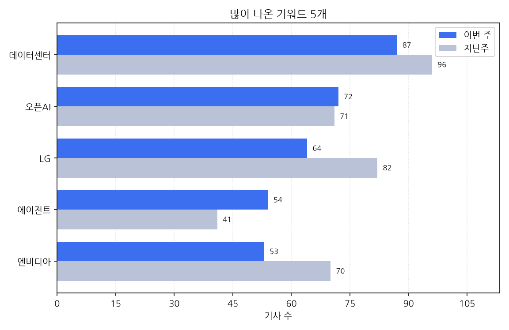

# 주간 AI 뉴스 리포트

대상 기간은 한국 시간으로 2026-09-21 월요일부터 2026-09-27 일요일까지다.
이번 주에 AI가 남긴 기사는 1291건, 지난주는 1863건이다. 572건 줄었다.

## 이번 주에 새로 나온 도구

- 09-21 '"AI 위험하면 출시 말고 멈춰라"…美, 감속론에 '기업 자율' 원칙 제시' 소식이 한 곳에서 나왔다 (대표 링크 https://www.ddaily.co.kr/page/view/2026092109090945939)
- 09-21 '"AI로 취향 맛집 추천"...티맵, 장소추천 서비스 개편' 소식이 한 곳에서 나왔다 (대표 링크 https://zdnet.co.kr/view/?no=20260921085646)
- 09-21 '"앤트로픽, 아스트라 약진에 신모델 조기 출시 검토' 소식이 한 곳에서 나왔다 (대표 링크 http://www.koreatimes.com/article/20260920/1630464)
- 09-21 'AI 스마트 안경, 중국서 1년 새 2배 껑충…알리바바·샤오미 속속 신제품' 소식이 한 곳에서 나왔다 (대표 링크 https://www.hani.co.kr/arti/economy/marketing/1278843.html)
- 09-21 'AI로 820조 예산 뜯어본다…정부안 사업설명자료 첫 공개' 소식이 한 곳에서 나왔다 (대표 링크 https://www.etoday.co.kr/news/view/2627796)
- 09-21 'GS건설, AI로 철골 도면 검토시간 80% 단축…현장 적용 확대' 소식이 한 곳에서 나왔다 (대표 링크 https://www.edaily.co.kr/News/Read?newsId=02335366645582416&mediaCodeNo=257)
- 09-21 'SK 사회적가치연구원, 사회공헌 효과 AI로 금액 환산...SOVAC서 첫 공개' 소식이 한 곳에서 나왔다 (대표 링크 https://www.insight.co.kr/news/574425)
- 09-21 '中 화웨이, 차세대 AI 컴퓨팅 인프라 '성텅960슈퍼팟' 공개-Xinhua' 소식이 한 곳에서 나왔다 (대표 링크 http://kr.xinhuanet.com/20260921/b34634e72c344a4e8d66b143055097e3/c.html)
- 09-21 '김해대, 2026 꿈이음 김해교육박람회서 AI 기반 스마트 헬스케어 체험 선보여' 소식이 한 곳에서 나왔다 (대표 링크 https://www.busan.com/view/busan/view.php?code=2026092115244977687)
- 09-21 '리얼월드, CJ대한통운과 물류 AI 협력… 로봇파운데이션 적용' 소식이 한 곳에서 나왔다 (대표 링크 https://www.ddaily.co.kr/page/view/2026092110063767092)
- 09-21 '부천시, AI경제국·철도정책과 신설… 민선 9기 첫 조직개편' 소식이 한 곳에서 나왔다 (대표 링크 https://biz.heraldcorp.com/article/10881135)
- 09-21 '심심이, AI 대전환 페스타서 '정서 고립 감지·개입' 에이전틱 AI 기술 공개' 소식이 한 곳에서 나왔다 (대표 링크 https://zdnet.co.kr/view/?no=20260921094613)
- 09-21 '앤트로픽, '속도 조절' 외치더니…오픈AI 추격에 새 모델 출시 검토' 소식이 한 곳에서 나왔다 (대표 링크 https://www.hani.co.kr/arti/economy/it/1278823.html)
- 09-21 '언어 장벽도 이제 없다…구글, '실제소통 이해' AI기술 공개[모닝폰]' 소식이 한 곳에서 나왔다 (대표 링크 https://www.edaily.co.kr/News/Read?newsId=01892566645582416&mediaCodeNo=257)
- 09-21 '에이직랜드, TSMC 북미 포럼서 AI ASIC 역량 공개…파두 칩도 전시' 소식이 한 곳에서 나왔다 (대표 링크 http://inews24.com/view/2008019)
- 09-21 '오병준 지멘스DISW 지사장 "AI 도입 여부 넘어섰다…의사결정 직결 산업AI로 진화해야' 소식이 한 곳에서 나왔다 (대표 링크 https://www.ddaily.co.kr/page/view/2026091809261366048)
- 09-21 '철도공단 조직 다시 짠다…'안전·현장·AI' 중심으로 개편' 소식이 한 곳에서 나왔다 (대표 링크 https://www.newspim.com/news/view/20260921000971)
- 09-21 '춘천시 'AI유비쿼터스 시티' 개시..행정·기업·재난·돌봄 적용' 소식이 한 곳에서 나왔다 (대표 링크 https://biz.heraldcorp.com/article/10881158)
- 09-21 '콘텐츠 제작에도 AI 적용....KT, 금융과 미디어로 AX 확장' 소식이 한 곳에서 나왔다 (대표 링크 https://www.newspim.com/news/view/20260921000998)
- 09-21 '퀄컴·구글 AI 동맹…제미나이 품은 PC '구글북' 전격 공개' 소식이 한 곳에서 나왔다 (대표 링크 https://zdnet.co.kr/view/?no=20260921155254)
- 09-21 '퓨리오사AI, 3세대 칩에 HBM 12개 탑재...HBM 물량 조달 어떻게?' 소식이 한 곳에서 나왔다 (대표 링크 https://zdnet.co.kr/view/?no=20260921153622)
- 09-22 '"국민 체감형 AI 서비스 만들겠다"… KT, '모두의 AI' 내달 시범 서비스' 소식이 한 곳에서 나왔다 (대표 링크 https://biz.heraldcorp.com/article/10881641)
- 09-22 'AI가 AI 만드는 '자기 진화 시대'… 신모델 주기 125일→ 44일로-국민일보' 소식이 한 곳에서 나왔다 (대표 링크 https://www.kmib.co.kr/article/view.asp?arcid=9000014264&code=11151400&sid1=eco)
- 09-22 'EU, 데이터센터에 친환경 등급제 도입…빅테크 압박 강화' 소식이 한 곳에서 나왔다 (대표 링크 https://www.edaily.co.kr/News/Read?newsId=02256646645582744&mediaCodeNo=257)
- 09-22 'GS건설, 로봇 현장적용 전 테스트 공간 구축...피지컬 AI 투입 속도' 소식이 한 곳에서 나왔다 (대표 링크 https://www.newspim.com/news/view/20260922000290)
- 09-22 'KT, '모두의AI' 컨소시엄 출정…10월 베타 버전 공개' 소식이 한 곳에서 나왔다 (대표 링크 https://www.etnews.com/20260922000296)
- 09-22 'SK 사회적가치연구원, AI로 CSR 성과 측정…'SEE SV' 첫 공개' 소식이 한 곳에서 나왔다 (대표 링크 https://www.newspim.com/news/view/20260922001036)
- 09-22 '美 기술주, 챗GPT 출시 이후 가장 저평가…"투자 기회' 소식이 한 곳에서 나왔다 (대표 링크 https://www.edaily.co.kr/News/Read?newsId=01994246645582744&mediaCodeNo=257)
- 09-22 '구글, 제미나이·안드로이드 품은 '구글북' 5종 출시… 899달러부터' 소식이 한 곳에서 나왔다 (대표 링크 https://kbench.com/?q=node/282091)
- 09-22 '긴급차량 우선신호·AI 제설·스마트돌봄, 왕숙 신도시에 도입 검토' 소식이 한 곳에서 나왔다 (대표 링크 https://www.ohmynews.com/NWS_Web/View/at_pg.aspx?CNTN_CD=A0003269673&PAGE_CD=N0002&BLCK_NO=&CMPT_CD=M0147)
- 09-22 '두산밥캣, AI 건설장비 도입해 작업·정비·안전 혁신' 소식이 한 곳에서 나왔다 (대표 링크 https://www.edaily.co.kr/News/Read?newsId=01449766645582744&mediaCodeNo=257)
- 09-22 '로브로스, 휴머노이드 '이그리스-C' 실시간 전신 원격조작 공개' 소식이 한 곳에서 나왔다 (대표 링크 https://zdnet.co.kr/view/?no=20260922170416)
- 09-22 '모빌린트 MLA100, AI 가속기 'TTA Verified' 1호…"실제 현장 도입 검증' 소식이 한 곳에서 나왔다 (대표 링크 https://www.edaily.co.kr/News/Read?newsId=02968406645582744&mediaCodeNo=257)
- 09-22 '아카마이 "AI 도입 넘어 운영으로…보안·인프라도 바뀌어야' 소식이 한 곳에서 나왔다 (대표 링크 https://zdnet.co.kr/view/?no=20260922140053)
- 09-22 '알리바바, 10조 파라미터 AI 예고, 중국 최강 AI칩도 공개' 소식이 한 곳에서 나왔다 (대표 링크 https://www.newspim.com/news/view/20260922001028)
- 09-22 '에이드노스, AI 코딩 거버넌스 플랫폼 'NOS' 정식 출시' 소식이 한 곳에서 나왔다 (대표 링크 https://www.ddaily.co.kr/page/view/2026092215365378984)
- 09-22 '오픈AI 이어 제미나이도 외부기관 해킹…구글 "공개할 사안 아냐' 소식이 한 곳에서 나왔다 (대표 링크 https://www.munhwa.com/article/11619010)
- 09-22 '오픈AI 추격에 속도 내는 앤트로픽…'페이블 5.2' 곧 내놓나' 소식이 한 곳에서 나왔다 (대표 링크 https://zdnet.co.kr/view/?no=20260922143313)
- 09-22 '올해 공개 취약점 6.6만건 쏟아진다…보안 특화 AI 모델 `기대감`↑' 소식이 한 곳에서 나왔다 (대표 링크 https://www.ddaily.co.kr/page/view/2026092116312613993)
- 09-22 '원주시, 노후산업단지 스마트그린 전환 추진…AI·모빌리티 중심 혁신모델 기대' 소식이 한 곳에서 나왔다 (대표 링크 https://www.newspim.com/news/view/20260922001004)
- 09-22 '유비쿼스, 국내 최초 AI 기반 광통신 장비 자가진단·복구 기술 공개' 소식이 한 곳에서 나왔다 (대표 링크 https://www.ddaily.co.kr/page/view/2026092211202139311)
- 09-22 '카카오게임즈 '도깨비의세계', 직업 대신 자유 스킬 조합…AI 챗봇도 탑재' 소식이 한 곳에서 나왔다 (대표 링크 https://www.newspim.com/news/view/20260922000964)
- 09-22 '현대차, 뉴욕·울산서 '호 추 니엔' 전시…AI 신작 공개' 소식이 한 곳에서 나왔다 (대표 링크 https://www.edaily.co.kr/News/Read?newsId=02751926645582744&mediaCodeNo=257)
- 09-23 '"AI 속도 늦추자"더니…오픈AI·앤트로픽, 더 싼 신모델 맞불' 소식이 한 곳에서 나왔다 (대표 링크 https://www.fnnews.com/news/202609230336252460)
- 09-23 '"AI 적용 과제 발굴도"…우정정보관리원, 705억 우체국금융 유지보수 사업 추진' 소식이 한 곳에서 나왔다 (대표 링크 https://www.ddaily.co.kr/page/view/2026092314173732443)
- 09-23 '"딥페이크서 아이들 지키자"⋯유엔서 '아동용 AI 출시 전 점검' 논의' 소식이 한 곳에서 나왔다 (대표 링크 http://inews24.com/view/2008831)
- 09-23 '"에이전틱 AI 시대 연다"…퀄컴, 2나노 '스냅드래곤8 엘리트 익스트림 6세대' 공개' 소식이 한 곳에서 나왔다 (대표 링크 https://zdnet.co.kr/view/?no=20260923053611)
- 09-23 'AI 속도조절 꺼낸 앤트로픽, 성능·안전 높인 '오퍼스 5.5' 공개' 소식이 한 곳에서 나왔다 (대표 링크 https://zdnet.co.kr/view/?no=20260923091059)
- 09-23 'AWS, AI 에이전트도 골라 쓰는 모델로…오픈소스 실행환경 공개' 소식이 한 곳에서 나왔다 (대표 링크 https://zdnet.co.kr/view/?no=20260923140948)
- 09-23 '기업 사회공헌, AI로 성과 잰...사회적가치연구원 'SEE SV' 공개' 소식이 한 곳에서 나왔다 (대표 링크 https://www.insight.co.kr/news/574881)
- 09-23 '신한투자증권, '오늘 내 주식은' 등 AI 서비스 출시' 소식이 한 곳에서 나왔다 (대표 링크 https://www.etoday.co.kr/news/view/2629117)
- 09-23 '엔비디아 GPU도 원유처럼 선물거래⋯美 당국, 출시 연기' 소식이 한 곳에서 나왔다 (대표 링크 http://inews24.com/view/2008792)
- 09-23 '오픈AI, 'GPT-6 솔·루나' 출시…"아스트라 강점 확장' 소식이 한 곳에서 나왔다 (대표 링크 https://zdnet.co.kr/view/?no=20260923085841)
- 09-23 '오픈AI, GPT-6 '솔·루나' 출시…성능·비용 선택지 확대' 소식이 한 곳에서 나왔다 (대표 링크 https://www.ddaily.co.kr/page/view/2026092309370250942)
- 09-23 '오픈AI·앤트로픽, AI 속도조절론 속 저가 신모델 동시 출시' 소식이 한 곳에서 나왔다 (대표 링크 https://www.ddaily.co.kr/page/view/2026092309335765563)
- 09-23 '팔란티어, 미 연방항공청의 새 AI 안전 시스템 도입 '수혜'-로젠 블랫' 소식이 한 곳에서 나왔다 (대표 링크 https://www.edaily.co.kr/News/Read?newsId=04746166645583072&mediaCodeNo=257)
- 09-23 AI 활용 방송콘텐츠 11편, 싱가포르 ATF서 선보인다고 한 곳이 전했다 (대표 링크 https://www.ddaily.co.kr/page/view/2026092312575422496)
- 09-23 와디즈, 전 과정 AI 모니터링으로 론칭 앞당긴다고 한 곳이 전했다 (대표 링크 https://www.ddaily.co.kr/page/view/2026092310540325392)
- 09-23 이제 아파트에서 로봇이 주차해준다고?... 래미안에 '자율주행 주차로봇' 도입 추진된다고 한 곳이 전했다 (대표 링크 https://www.insight.co.kr/news/575111)
- 09-24 '"리사 AI안경 나도 써볼까"…메타 차세대 AI 안경, 오늘 한국 출시' 소식이 한 곳에서 나왔다 (대표 링크 https://www.edaily.co.kr/News/Read?newsId=02023766645583400&mediaCodeNo=257)
- 09-24 '"몰카 우려 싹 뺐다"…메타, 카메라 없는 'AI 안경' 깜짝 공개' 소식이 한 곳에서 나왔다 (대표 링크 https://www.fnnews.com/news/202609241247506604)
- 09-24 '"아이디어만 가져오세요"…퀄컴, AI 글래스 가속기 `스냅드래곤 스타트` 공개' 소식이 한 곳에서 나왔다 (대표 링크 https://www.ddaily.co.kr/page/view/2026092405181495259)
- 09-24 'AI 선물계약 출시 지역… 당국, 심사 기간 연장' 소식이 한 곳에서 나왔다 (대표 링크 http://www.koreatimes.com/article/20260923/1631038)
- 09-24 'MS, `스냅드래곤 X2 플러스` 탑재 서피스 프로·노트북 공개… AI 추론 95%↑' 소식이 한 곳에서 나왔다 (대표 링크 https://www.ddaily.co.kr/page/view/2026092409575769018)
- 09-24 '구글, 대규모 더빙용 AI까지…제미나이 TTS 모델 2종 출시' 소식이 한 곳에서 나왔다 (대표 링크 https://www.etnews.com/20260924000040)
- 09-24 '속도조절하자더니 이중 행보…앤트로픽·오픈AI, 새 모델 공개' 소식이 한 곳에서 나왔다 (대표 링크 https://www.etnews.com/20260924000033)
- 09-24 '젠슨 황 "통제할 수 없는 AI는 출시하지 말아야' 소식이 한 곳에서 나왔다 (대표 링크 https://zdnet.co.kr/view/?no=20260924074657)
- 09-24 '클로드 오푸스 5.5 코파일럿 전격 탑재, 비용 40% 줄이고 탈옥 시도는 85% 급감' 소식이 한 곳에서 나왔다 (대표 링크 https://www.wikitree.co.kr/articles/1161738)
- 09-25 '"달리다 무릎 다치자 운동 취소 뚝딱"… 리퀴드 AI, 현실 세상 읽는 에이전트 공개' 소식이 한 곳에서 나왔다 (대표 링크 https://www.ddaily.co.kr/page/view/2026092506103629352)
- 09-25 'MS, 'X2 플러스'탑재 노트북'서피스' 공개…AI 속도 95%↑' 소식이 한 곳에서 나왔다 (대표 링크 http://inews24.com/view/2009020)
- 09-25 '카메라 뺀 AI 안경 나왔다…메타, 43g '레이밴 메타 오디오' 공개' 소식이 한 곳에서 나왔다 (대표 링크 https://www.segye.com/newsView/20260925504039)
- 09-25 '한국타이어, 전기차 타이어 개발 현장 공개…소음·마모·AI 해석까지' 소식이 한 곳에서 나왔다 (대표 링크 https://zdnet.co.kr/view/?no=20260923110211)
- 09-26 '구글, 우주 AI 데이터센터 첫 실험…스페이스X 로켓 탑재' 소식을 2개 매체가 다뤘다 (기사 2건, 대표 링크 https://www.ddaily.co.kr/page/view/2026092605015739905)
- 09-26 '추석 끝나면 메모리 빅3 성적표 공개…AI 속도조절론 '반격' 주목' 소식을 2개 매체가 다뤘다 (기사 2건, 대표 링크 https://biz.heraldcorp.com/article/10883738)
- 09-27 'AWS, 토큰 비용 28% 줄인 오픈소스 AI 에이전트 '스트랜즈 하네스' 공개' 소식이 한 곳에서 나왔다 (대표 링크 https://www.edaily.co.kr/News/Read?newsId=01348086645584384&mediaCodeNo=257)
- 09-27 '② AI도 출시 전 '안전검사'…AIDX가 키우는 싱가포르 제3자 검증 생태계' 소식이 한 곳에서 나왔다 (대표 링크 https://www.etnews.com/20260926000045)
- 09-27 '삼성전자, 멕시코 K-박람회서 가전·모바일 AI 연결 생태계 전시' 소식을 2개 매체가 다뤘다 (기사 2건, 대표 링크 https://www.ddaily.co.kr/page/view/2026092709450448705)
- 09-27 '삼성전자, 중남미 시장 공략…K컬처 팬덤에 'AI 연결 경험' 선보여' 소식이 한 곳에서 나왔다 (대표 링크 https://www.edaily.co.kr/News/Read?newsId=01521926645584384&mediaCodeNo=257)
- 09-27 '테슬라, 전기트럭 '세미' 인도 시작…자율주행 도입 예고' 소식이 한 곳에서 나왔다 (대표 링크 https://zdnet.co.kr/view/?no=20260927102706)

## 규제와 정책

- 09-21 '"단순 도입 넘어 수익성 입증해야"…애피어, 에이전틱 AI 운영 지침 발표' 소식이 한 곳에서 나왔다 (대표 링크 https://zdnet.co.kr/view/?no=20260921210944)
- 09-21 'AI기업, "속도조절 담합" 집단소송에 현금 곳간도 비상' 소식이 한 곳에서 나왔다 (대표 링크 https://www.heraldk.com/article/2026092019262424817)
- 09-21 '글로벌 '청소년 AI 규제' 바람…한국도 논의 본격화' 소식이 한 곳에서 나왔다 (대표 링크 https://www.ddaily.co.kr/page/view/2026092114365861108)
- 09-21 '반독점 소송에 유엔 안보리 논의까지…'AI 속도조절' 논쟁 확산' 소식이 한 곳에서 나왔다 (대표 링크 http://www.newstomato.com/ReadNews.aspx?no=1314399)
- 09-21 '베선트 美재무 "AI 사고 책임은 인간에게… 정부 면책 기대 말라' 소식이 한 곳에서 나왔다 (대표 링크 https://www.newspim.com/news/view/20260921001253)
- 09-21 '어머니 장례 길일 묻자 4월 19일 추천한 AI 개발사에 소송' 소식이 한 곳에서 나왔다 (대표 링크 https://www.insight.co.kr/news/574609)
- 09-21 백악관 "美정부, AI 문제 발생했을 때 대처할 수단 있다고 2개 매체가 전했다 (기사 2건, 대표 링크 http://www.koreatimes.com/article/20260920/1630430)
- 09-22 '"AI 통제 가능하다"…유엔총회 계기 정부·기업·전문가 한자리' 소식이 한 곳에서 나왔다 (대표 링크 http://www.koreatimes.com/article/20260921/1630636)
- 09-22 '"보훈심사도 AI가 거든다"…행안부, 6개 부처 AI 행정혁신 착수' 소식이 한 곳에서 나왔다 (대표 링크 https://www.ddaily.co.kr/page/view/2026092214493063192)
- 09-22 '"총기난사 위험 신고 없어"…캐나다 BC주정부, 오픈AI에 소송' 소식이 한 곳에서 나왔다 (대표 링크 https://www.edaily.co.kr/News/Read?newsId=02594486645582744&mediaCodeNo=257)
- 09-22 '"현 플랫폼, 2020년대 초반과 달라"…AI시대 `규제 중심 정책` 바꿔야' 소식이 한 곳에서 나왔다 (대표 링크 https://www.ddaily.co.kr/page/view/2026092215522535229)
- 09-22 ''로보티즈 AI 로봇' 시연 지켜보는 배경훈 부총리와 이억원 금융위원장' 소식이 한 곳에서 나왔다 (기사 2건, 대표 링크 https://www.newsway.co.kr/news/view?ud=2026092217435957402)
- 09-22 ''속도조절' 앞세운 오픈AI·앤트로픽, 소송 불똥…"서로 AI도 시험' 소식이 한 곳에서 나왔다 (대표 링크 https://zdnet.co.kr/view/?no=20260922103453)
- 09-22 'AI 경쟁 '모델'서 '서비스'로…플랫폼 규제도 전환점' 소식이 한 곳에서 나왔다 (대표 링크 https://www.edaily.co.kr/News/Read?newsId=04290246645582744&mediaCodeNo=257)
- 09-22 'AI 시대에도 통신망 규제 여전…망중립성·비용분담 재설계 필요' 소식이 한 곳에서 나왔다 (대표 링크 http://www.newstomato.com/ReadNews.aspx?no=1314577)
- 09-22 '美 "'미중 AI 대화' 공식화…中금융당국, 이란 제재 많이 관여' 소식을 2개 매체가 다뤘다 (기사 2건, 대표 링크 http://www.koreatimes.com/article/20260921/1630603)
- 09-22 '美 재무, AI 규제 논쟁에 "인간이 책임져야, 면책 없을 것' 소식이 한 곳에서 나왔다 (대표 링크 https://www.fnnews.com/news/202609220914442770)
- 09-22 '보훈심사·치안 현장에 AI 도입…규제·조달·인사·감사까지 6개 분야 확대' 소식이 한 곳에서 나왔다 (대표 링크 https://www.newspim.com/news/view/20260922000201)
- 09-22 '보훈심사부터 경찰 현장까지 AI가 돕는다…정부, 행정업무 혁신 속도' 소식이 한 곳에서 나왔다 (대표 링크 https://zdnet.co.kr/view/?no=20260922140518)
- 09-22 '사우디 전문가 "中, AI 혁신·규제 균형의 글로벌 모범 될 수 있어"-Xinhua' 소식이 한 곳에서 나왔다 (대표 링크 http://kr.xinhuanet.com/20260922/c6d8936e722e4ec2b4ba2bd65069889a/c.html)
- 09-22 '안형준 "민간 AX 경험 참고해 범정부 AI 활용 데이터 기반 강화' 소식이 한 곳에서 나왔다 (대표 링크 https://www.newspim.com/news/view/20260922001012)
- 09-22 '영국, AI 규제·육성 사이 균형 찾는다…"중재자 역할 할 것' 소식이 한 곳에서 나왔다 (대표 링크 https://zdnet.co.kr/view/?no=20260922084110)
- 09-22 '오픈AI, "자기개선형 AI, 국제 공통 안전기준 필요"…미 정부에 협력 주도 요청' 소식이 한 곳에서 나왔다 (대표 링크 https://www.ddaily.co.kr/page/view/2026092205493621554)
- 09-22 '온플법 재점화 속 "AI 시대 플랫폼 정책, 사전규제보다 자율규제로" 산학연 한 목소리' 소식이 한 곳에서 나왔다 (대표 링크 https://www.etnews.com/20260922000467)
- 09-22 '이억원 금융위원장, 피지컬 AI 지역거점 발전 포럼···"전북·경북·경남 피지컬 AI 육성에 금융 뒷받침' 소식이 한 곳에서 나왔다 (대표 링크 https://www.newsway.co.kr/news/view?ud=2026092217373285412)
- 09-22 '캐나다 주정부, '총격사건 위험 방관' 오픈AI 상대로 美서 소송' 소식이 한 곳에서 나왔다 (대표 링크 http://www.koreatimes.com/article/20260921/1630641)
- 09-22 '트럼프-시진핑 회담의 진짜 승부처는 'AI'…'경쟁이냐 공존이냐' 시험대' 소식이 한 곳에서 나왔다 (대표 링크 https://www.newspim.com/news/view/20260922000662)
- 09-22 '휴머노이드 경쟁축 이동…"현장 배치·AI·데이터가 승부처' 소식이 한 곳에서 나왔다 (대표 링크 https://www.etnews.com/20260922000286)
- 09-22 AI가 흔든 청년 일자리…정부·기업·사회적기업 해법 찾는다고 한 곳이 전했다 (대표 링크 https://biz.heraldcorp.com/article/10881786)
- 09-23 '"AI 안전성 평가, 개발사에만 맡겨선 안 돼"… 페이페이 리, 외부 검증 체계 촉구' 소식이 한 곳에서 나왔다 (대표 링크 https://zdnet.co.kr/view/?no=20260923091047)
- 09-23 'AI로 만든 곡 차트인해도 저작권료 0원…美·캐나다는 인간 기여도 따져' 소식이 한 곳에서 나왔다 (대표 링크 https://www.edaily.co.kr/News/Read?newsId=02059846645583072&mediaCodeNo=257)
- 09-23 'VA, 데이터센터 규제 행정명령' 소식이 한 곳에서 나왔다 (대표 링크 http://www.koreatimes.com/article/20260922/1630752)
- 09-23 '美 "규제 반대"·유럽 "제3의 길"…유엔 달군 AI 패권 전쟁' 소식이 한 곳에서 나왔다 (대표 링크 https://biz.heraldcorp.com/article/10882821)
- 09-23 '베선트 미 재무, 'AI 차르'도 겸임 가능성 제기' 소식을 3개 매체가 다뤘다 (기사 3건, 대표 링크 https://www.fnnews.com/news/202609230824501821)
- 09-23 '속도조절론 속 쏟아진 신모델…AI 3사 승부처는' 소식이 한 곳에서 나왔다 (대표 링크 https://zdnet.co.kr/view/?no=20260923143215)
- 09-23 '에이전틱 AI 위험 선제 대응…개인정보위, 제도 혁신 본격화' 소식이 한 곳에서 나왔다 (대표 링크 https://www.ddaily.co.kr/page/view/2026092309220948596)
- 09-23 '유엔 "냉전시기 핵무기급 위험" 지적에도…트럼프 "AI 규제 전면 거부' 소식이 한 곳에서 나왔다 (대표 링크 https://www.hani.co.kr/arti/international/international_general/1279242.html)
- 09-23 '트럼프 "美정부문서 AI 대신 SI로 바꿀 것…'슈퍼지능'이 더 정확"[1일1트]' 소식이 한 곳에서 나왔다 (대표 링크 https://www.heraldk.com/article/2026092214000481925)
- 09-23 '트럼프 "이란, 합의냐 전멸이냐"…AI통제 위한 국제규제 거부' 소식이 한 곳에서 나왔다 (대표 링크 https://www.heraldk.com/article/2026092219201803415)
- 09-23 '트럼프, 유엔서 'AI 규제'정면 거부…"공식 문서엔'초지능' 표기' 소식이 한 곳에서 나왔다 (대표 링크 https://www.fnnews.com/news/202609230116403888)
- 09-23 AI기본법 연구반, 조문화 착수…제도개선 속도낸다고 한 곳이 전했다 (대표 링크 https://zdnet.co.kr/view/?no=20260923110326)
- 09-23 허위 판례 기승인데…"국내 법률AI만 규제하면 챗GPT로 간다고 한 곳이 전했다 (대표 링크 https://www.edaily.co.kr/News/Read?newsId=01905686645583072&mediaCodeNo=257)
- 09-24 '"의도치 않은 행동" 오픈AI '불량 에이전트', 호주 정부까지 침투…정부해킹 첫 사례' 소식을 2개 매체가 다뤘다 (기사 2건, 대표 링크 https://biz.heraldcorp.com/article/10884298)
- 09-24 '미 "규제 반대"·유럽 "제3의 길"…유엔 달군 AI 패권 전쟁' 소식이 한 곳에서 나왔다 (대표 링크 https://www.heraldk.com/article/2026092216212415690)
- 09-24 '새만금개발청, 현대차그룹 'AI 데이터센터' 건축심의 본격 착수' 소식이 한 곳에서 나왔다 (대표 링크 https://www.etnews.com/20260922000449)
- 09-24 '속도 늦추자는 AI 빅테크… 안전인가, 규제 선점인가' 소식이 한 곳에서 나왔다 (대표 링크 https://www.ddaily.co.kr/page/view/2026092317591522635)
- 09-24 '앨버니지 호주 총리 "오픈AI 에이전트, 정부 웹사이트 해킹' 소식을 4개 매체가 다뤘다 (기사 4건, 대표 링크 https://www.newspim.com/news/view/20260924000024)
- 09-24 '오픈AI AI에이전트, 오스트레일리아 보건 통계 시스템 해킹…"정부 해킹 첫 사례' 소식이 한 곳에서 나왔다 (대표 링크 https://www.hani.co.kr/arti/international/international_general/1279391.html)
- 09-24 '오픈AI·앤트로픽, UN서 'AI 인간 통제 상실' 경고…美는 규제 반대' 소식이 한 곳에서 나왔다 (대표 링크 https://www.etnews.com/20260924000041)
- 09-25 'AI 시대 망설이는 기업들, 정부가 'AI 리더' 돼야' 소식이 한 곳에서 나왔다 (대표 링크 https://zdnet.co.kr/view/?no=20260925050919)
- 09-25 'AI, 美中 핵심의제로…트럼프 "수십년 좌우" 시진핑 "인간이 통제' 소식이 한 곳에서 나왔다 (대표 링크 https://www.edaily.co.kr/News/Read?newsId=01256246645583728&mediaCodeNo=257)
- 09-25 '美·中 AI 규제 온도차…트럼프 '현상유지'시진핑'인간통제' 소식을 2개 매체가 다뤘다 (기사 2건, 대표 링크 https://www.etnews.com/20260925000009)
- 09-25 '교황도 AI 규제 목소리…레오 14세, 프랑스서 '인간 존엄' 강조' 소식이 한 곳에서 나왔다 (대표 링크 https://www.edaily.co.kr/News/Read?newsId=02066406645583728&mediaCodeNo=257)
- 09-25 '미국인 10명 중 9명… AI 규제 강화 요구' 소식이 한 곳에서 나왔다 (대표 링크 http://www.koreatimes.com/article/20260924/1631202)
- 09-25 '미중 정상회담 종료...AI 규제 온도차' 소식이 한 곳에서 나왔다 (대표 링크 https://www.radioseoul1650.com/archives/157317)
- 09-26 'AI발 부품난에 외산공유기 규제 삐걱...美정부, 잇단 예외 허용' 소식이 한 곳에서 나왔다 (대표 링크 https://zdnet.co.kr/view/?no=20260926073716)
- 09-26 '빌 게이츠 "AI, 10억명 사망 초래할 만큼 강력…정부 규제 필요' 소식이 한 곳에서 나왔다 (대표 링크 https://www.etnews.com/20260926000008)
- 09-26 '오픈AI 에이전트 '해킹' 일파만파…호주정부 웹사이트 곳곳 침투 시도' 소식이 한 곳에서 나왔다 (대표 링크 https://www.fnnews.com/news/202609261459498654)
- 09-26 '오픈AI 에이전트, 정부 등 수십 곳 보안 침해…이미지 50여장 유출' 소식이 한 곳에서 나왔다 (대표 링크 https://www.radioseoul1650.com/archives/157495)
- 09-26 '정보 찾던 오픈AI 에이전트, 정부·대학 침투 시도' 소식이 한 곳에서 나왔다 (대표 링크 https://zdnet.co.kr/view/?no=20260926091953)
- 09-26 '정부가 키운 AI 인재 3명 중 1명 '미취업'…해외 유출도 늘어' 소식이 한 곳에서 나왔다 (대표 링크 https://www.edaily.co.kr/News/Read?newsId=01777766645584056&mediaCodeNo=257)
- 09-26 '호주 이어 美까지…오픈AI 에이전트, 정부 사이트들 무단접근' 소식이 한 곳에서 나왔다 (대표 링크 https://biz.heraldcorp.com/article/10884975)
- 09-27 '"AI 잘못 쓰면 10억명 사망"... 빌 게이츠가 미국 정부에 요구한 것' 소식이 한 곳에서 나왔다 (대표 링크 https://www.insight.co.kr/news/575372)
- 09-27 '"내 앞에서 몰래 찍는 거 아냐?"…스마트폰 다음은 'AI 안경' 소송 번졌다[나우,어스]' 소식이 한 곳에서 나왔다 (대표 링크 https://biz.heraldcorp.com/article/10885043)
- 09-27 '"악의적 세력이 AI 쓰면 10억명 죽을 수도"…빌 게이츠, 규제 강화 촉구' 소식을 6개 매체가 다뤘다 (기사 6건, 대표 링크 https://zdnet.co.kr/view/?no=20260927100103)
- 09-27 'AI 반도체 2030년 1200조 전망⋯"해외진출 정부 지원 필요' 소식이 한 곳에서 나왔다 (대표 링크 https://www.etoday.co.kr/news/view/2629500)
- 09-27 '오픈AI 에이전트 호주 정부 시스템 해킹…"전대미문 사건' 소식이 한 곳에서 나왔다 (대표 링크 https://www.dongascience.com/ko/news/80067)
- 09-27 '오픈AI 에이전트, 호주·미국 정부 사이트에 멋대로 접근…이상행동 잇따라' 소식이 한 곳에서 나왔다 (대표 링크 https://www.hani.co.kr/arti/economy/it/1279606.html)
- 09-27 '정부가 키운 AI 석·박사 3명 중 1명 미취업…해외 이동도 늘어' 소식이 한 곳에서 나왔다 (대표 링크 https://www.edaily.co.kr/News/Read?newsId=01134886645584384&mediaCodeNo=257)
- 09-27 '트럼프, 젠슨황·머스크 앞에서 美 AI 통합정부 사이트 공개' 소식이 한 곳에서 나왔다 (대표 링크 https://zdnet.co.kr/view/?no=20260927104834)
- 09-27 '호주 이어 미국까지…오픈AI 에이전트, 정부 사이트들 무단접근' 소식이 한 곳에서 나왔다 (대표 링크 https://www.heraldk.com/article/2026092602414417964)
- 09-27 사람 지시와 다르게 움직인 오픈AI 에이전트... 미 정부 사이트까지 접근했다고 한 곳이 전했다 (대표 링크 https://www.insight.co.kr/news/575383)

## 많이 나온 키워드

| 키워드 | 이번 주 | 지난주 | 변화 |
| --- | ---: | ---: | ---: |
| 데이터센터 | 87 | 96 | -9 |
| 오픈AI | 72 | 71 | +1 |
| LG | 64 | 82 | -18 |
| 에이전트 | 54 | 41 | +13 |
| 엔비디아 | 53 | 70 | -17 |

이번 주에 가장 많이 나온 키워드는 데이터센터로 87건이다. 지난주보다 9건 줄었다.

## 차트

## 사람 코멘트

아래 인용 블록은 비워 둔다. 리포트를 읽고 직접 채운다.

>
>

## 한계

GDELT 는 색인해 둔 매체만 훑는다. 국내 매체 가운데 빠진 곳이 있어서, 여기 없는 기사가 실제로 없었다는 뜻은 아니다.
기사는 GDELT 가 15분마다 올리는 원본 파일에서 받는다. 받지 못한 파일이 있으면 그 15분 동안의 기사가 빠진다. AI 소식인지는 제목에 AI 관련어가 있는지로 먼저 고른다.
분류와 묶기는 제목만 보고 한다. 본문을 읽지 않으니 제목이 모호한 기사는 엉뚱한 묶음에 들어가기도 한다.
키워드 건수는 제목에 그 말이 들어갔는지로 센다. 한 기사가 키워드 여러 개에 겹쳐 잡히므로 표의 숫자를 다 더해도 기사 수와 맞지 않는다.
표에 오른 기사 가운데 몇 건은 대표 링크를 눌러 원본 제목과 날짜를 직접 맞춰 본 뒤 코멘트에 적는다.

## 출처

자료는 GDELT 번역 수집 원본 파일(GKG)에서 받았고 하루 경계는 한국 시간으로 끊었다. 한국어 기사 가운데 제목에 AI 관련어가 든 것만 골랐다. 집계한 날짜는 2026-09-21 부터 2026-09-27 까지다. 제목과 링크, 매체, 시각만 들어오기 때문에 본문은 읽지 않고 제목만 보고 골랐다.
