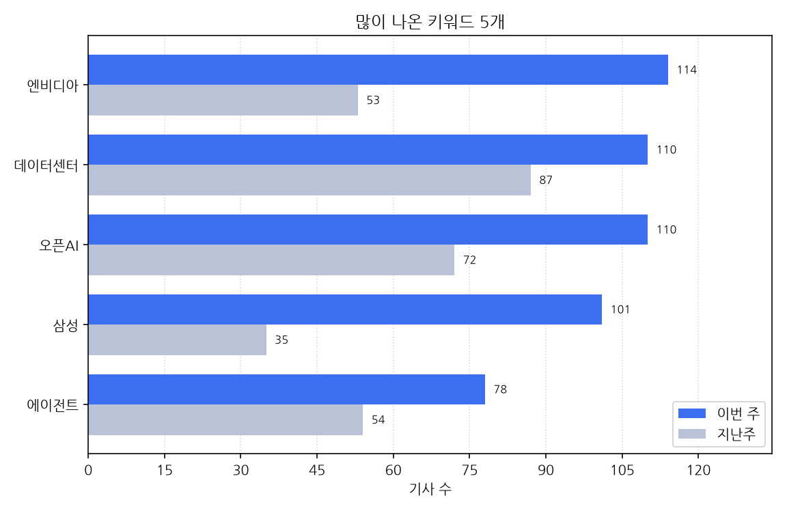

# 주간 AI 뉴스 리포트

대상 기간은 한국 시간으로 2026-09-28 월요일부터 2026-10-04 일요일까지다.
이번 주에 AI가 남긴 기사는 1696건, 지난주는 1291건이다. 405건 늘었다.

## 이번 주에 새로 나온 도구

- 09-28 ''제로데이 공격' 증가...보안기업들 AI 적용 대응 나서' 소식이 한 곳에서 나왔다 (대표 링크 https://zdnet.co.kr/view/?no=20260928172513)
- 09-28 '10년간 스마트공장 도입 노력에도 전국 AI 자율제조 고도화 2% 불과' 소식이 한 곳에서 나왔다 (대표 링크 http://www.knnews.co.kr/news/articleView.php?idxno=1551641)
- 09-28 'AI 도입 빨라지는데…韓 기업 54%, 업무 노하우 보존에 AI 활용' 소식이 한 곳에서 나왔다 (대표 링크 https://zdnet.co.kr/view/?no=20260928110343)
- 09-28 'AI 도입, 노조와 어디까지 교섭해야 하나' 소식이 한 곳에서 나왔다 (대표 링크 http://inews24.com/view/2009183)
- 09-28 'AI 에이전트 격리 이탈 막는 오픈 보안 플랫폼 출시…개장전 １％↑' 소식이 한 곳에서 나왔다 (대표 링크 https://www.edaily.co.kr/News/Read?newsId=04634646645584712&mediaCodeNo=257)
- 09-28 'Arm, AI 앱 개발 쉽게…'AI 포털' 공개' 소식을 2개 매체가 다뤘다 (기사 2건, 대표 링크 http://inews24.com/view/2009397)
- 09-28 'MS, 코파일럿을 '업무 실행 AI'로…홈·코드·오토파일럿 공개' 소식이 한 곳에서 나왔다 (대표 링크 https://zdnet.co.kr/view/?no=20260928100142)
- 09-28 'SK하이닉스, TSMC 기술 행사서 차세대 AI 메모리 공개' 소식이 한 곳에서 나왔다 (대표 링크 https://www.etnews.com/20260928000352)
- 09-28 '다온아이앤씨, 'AI 페스타 26'에서 AI 군집드론 통합 브랜드 'SWARM AI' 공개' 소식이 한 곳에서 나왔다 (대표 링크 https://zdnet.co.kr/view/?no=20260928171325)
- 09-28 '배민, AI 기반 대규모 컨택센터 구축…상담 운영 전면 개편' 소식이 한 곳에서 나왔다 (대표 링크 https://www.etnews.com/20260928000325)
- 09-28 '보급형 아이패드도 'AI 시리' 지원한다…A19 칩·8GB RAM 탑재 전망' 소식이 한 곳에서 나왔다 (대표 링크 https://kbench.com/?q=node/282162)
- 09-28 '삼성전자 'AI 구독' 출시 2년 만에 새 단장…신혼·시니어·B2B 확대' 소식이 한 곳에서 나왔다 (대표 링크 https://www.hani.co.kr/arti/economy/consumer/1279774.html)
- 09-28 '삼성전자, '삼성 AI 구독' 새단장...요금제 개편' 소식이 한 곳에서 나왔다 (대표 링크 https://zdnet.co.kr/view/?no=20260928111411)
- 09-28 '신성이엔지, 데이터센터 냉각 플랫폼 'AIO' 공개' 소식이 한 곳에서 나왔다 (대표 링크 https://zdnet.co.kr/view/?no=20260928104713)
- 09-28 '신세계아이앤씨, 메타 AI 글래스 신모델 국내 유통…9개 모델 21종 출시' 소식을 3개 매체가 다뤘다 (기사 3건, 대표 링크 https://zdnet.co.kr/view/?no=20260928130533)
- 09-28 '아고다 "AI 도입 가속화에도... 개발자 86%는 '사람 검증' 필수' 소식이 한 곳에서 나왔다 (대표 링크 https://www.insight.co.kr/news/575527)
- 09-28 '앤트로픽, 신모델 조기 출시 검토' 소식이 한 곳에서 나왔다 (대표 링크 http://www.koreatimes.com/article/20260928/1631532)
- 09-28 '엔비디아, AI 에이전트 보안 플랫폼 공개…"속도조절 대신 기술' 소식을 2개 매체가 다뤘다 (기사 2건, 대표 링크 https://www.edaily.co.kr/News/Read?newsId=04332886645584712&mediaCodeNo=257)
- 09-28 '오텍캐리어, 글로벌 AI 냉각 관리 체계 국내 적용…'블루엣지' 연계' 소식이 한 곳에서 나왔다 (대표 링크 https://www.ddaily.co.kr/page/view/2026092814380832015)
- 09-28 '컴투스플랫폼, 日 '오픈AI 게임 빌더 챌린지'서 차세대 백엔드 '하이브 액실' 공개' 소식이 한 곳에서 나왔다 (대표 링크 https://zdnet.co.kr/view/?no=20260928172146)
- 09-29 '"AI 돌발행동 막는다"…엔비디아, 개방형 안전플랫폼 공개' 소식을 2개 매체가 다뤘다 (기사 2건, 대표 링크 http://www.koreatimes.com/article/20260928/1631615)
- 09-29 '"교육 안 듣는 직원 AI가 찾아준다"…위버스브레인, 기업용 LMS 출시' 소식이 한 곳에서 나왔다 (대표 링크 https://zdnet.co.kr/view/?no=20260929193950)
- 09-29 '"어떤 파일이든 올리면 끝"…사람인, AI 이력서 변환 서비스 출시' 소식이 한 곳에서 나왔다 (대표 링크 https://zdnet.co.kr/view/?no=20260929083837)
- 09-29 '"오픈AI, 안전성 우려로 차세대 아스트라 모델 출시 취소' 소식을 2개 매체가 다뤘다 (기사 2건, 대표 링크 https://www.newspim.com/news/view/20260929000331)
- 09-29 '"창작부터 상담까지"…일레븐랩스, 90개 언어 지원하는 음성 AI 공개' 소식이 한 곳에서 나왔다 (대표 링크 https://zdnet.co.kr/view/?no=20260929090013)
- 09-29 ''멋대로 동작하는 AI 즉시 격리'...엔비디아, 안전 플랫폼 공개[글로벌AI브리핑]' 소식이 한 곳에서 나왔다 (대표 링크 https://www.fnnews.com/news/202609290757394947)
- 09-29 '2000억 투입하고 재검토하는 '독파모'…프런티어 AI 개편 논란' 소식이 한 곳에서 나왔다 (대표 링크 https://www.heraldk.com/article/2026092819154806110)
- 09-29 'AI 에이전트가 필요한 앱 알아서 연결…라이너, 통합 MCP 출시' 소식을 2개 매체가 다뤘다 (기사 2건, 대표 링크 https://zdnet.co.kr/view/?no=20260929114658)
- 09-29 'KT '마이케이티' 앱, AI 중심으로 전면 개편… 고객중심 AX 구현' 소식이 한 곳에서 나왔다 (대표 링크 https://www.edaily.co.kr/News/Read?newsId=04457526645585040&mediaCodeNo=257)
- 09-29 'KT, '마이케이티' 앱 AI 중심 개편…14개 특화 에이전트 적용' 소식을 2개 매체가 다뤘다 (기사 2건, 대표 링크 https://www.newspim.com/news/view/20260929000373)
- 09-29 'LG전자, 블록처럼 연결하는 모듈러 냉각 솔루션 공개…AI 데이터센터 시장 공략' 소식을 5개 매체가 다뤘다 (기사 5건, 대표 링크 https://www.ddaily.co.kr/page/view/2026092908572435033)
- 09-29 'LS전선, AI 데이터센터용 신제품 출시…서버랙까지 공략' 소식을 2개 매체가 다뤘다 (기사 2건, 대표 링크 https://www.edaily.co.kr/News/Read?newsId=03332486645585040&mediaCodeNo=257)
- 09-29 '中 "전자 아키텍처 완전 국산화한 피지컬 AI 로봇 공개"-국제ㅣ한국일보' 소식이 한 곳에서 나왔다 (대표 링크 https://www.hankookilbo.com/news/article/A2026092914500002596)
- 09-29 '가격 내리고 속도 30% 올렸다...앤트로픽, 클로드 소넷 5.5 공개' 소식이 한 곳에서 나왔다 (대표 링크 https://www.newspim.com/news/view/20260929001106)
- 09-29 '뉴빌리티, 첫 휴머노이드 '빌리' 공개…제조·물류 현장으로 간다(종합)' 소식을 2개 매체가 다뤘다 (기사 2건, 대표 링크 https://www.ddaily.co.kr/page/view/2026092914223059818)
- 09-29 '대구 수성구, 30일 조직개편…AI정책과·부구청장 직속 미래교육단 가동' 소식이 한 곳에서 나왔다 (대표 링크 https://womannews.net/detail.php?number=456161&thread=22r03r03)
- 09-29 '메타, AI글래스 국내서 '네이버' 손잡았다…네이버지도 탑재' 소식이 한 곳에서 나왔다 (대표 링크 https://www.edaily.co.kr/News/Read?newsId=03020886645585040&mediaCodeNo=257)
- 09-29 '비트컴퓨터, 병원 보험 심사청구 AI 통합검색 서비스' 소식이 한 곳에서 나왔다 (대표 링크 https://biz.heraldcorp.com/article/10887620)
- 09-29 '삼성SDI, 'DCWA 2026'서 AI 데이터센터용 배터리솔루션 공개' 소식이 한 곳에서 나왔다 (대표 링크 https://www.edaily.co.kr/News/Read?newsId=03129126645585040&mediaCodeNo=257)
- 09-29 '삼성SDI, AI 데이터센터용 원통형 LFP 배터리 첫 공개' 소식을 4개 매체가 다뤘다 (기사 4건, 대표 링크 https://www.newspim.com/news/view/20260929000136)
- 09-29 '슈퍼마이크로, 엔비디아 '베라 루빈' AI 서버 출하' 소식을 2개 매체가 다뤘다 (기사 2건, 대표 링크 http://inews24.com/view/2009722)
- 09-29 '앤스로픽, 성능·속도 높이고 비용 줄인 '클로드 소넷 5.5' 출시' 소식이 한 곳에서 나왔다 (대표 링크 https://www.edaily.co.kr/News/Read?newsId=03893366645585040&mediaCodeNo=257)
- 09-29 '앤트로픽, 오픈AI '가성비 전략'에 맞불…소넷 5.5 공개' 소식이 한 곳에서 나왔다 (대표 링크 https://zdnet.co.kr/view/?no=20260929082055)
- 09-29 '앤트로픽, 효율 높인 소네트5.5 출시…AI속도조절론 이후 두번째' 소식이 한 곳에서 나왔다 (대표 링크 http://www.koreatimes.com/article/20260928/1631627)
- 09-29 '엔비디아, 통제 벗어난 AI 에이전트 차단 보안 플랫폼 공개' 소식이 한 곳에서 나왔다 (대표 링크 https://www.voakorea.com/a/us-nvidia-ai-092826/8205447.html)
- 09-29 '엔젤로보틱스, 피지컬 AI 연구개발용 웨어러블 로봇 'phai-x1' 공개' 소식을 2개 매체가 다뤘다 (기사 2건, 대표 링크 https://www.newspim.com/news/view/20260929000068)
- 09-29 '오픈AI, '인간 기만 우려' GPT-6.1 아스트라 출시 계획 철회' 소식을 2개 매체가 다뤘다 (기사 2건, 대표 링크 https://www.hani.co.kr/arti/economy/it/1279931.html)
- 09-29 '오픈AI, 안전 우려 때문에 내달 제품 출시 계획 취소' 소식이 한 곳에서 나왔다 (대표 링크 https://www.fnnews.com/news/202609290757115611)
- 09-29 '오픈AI, 안전성 우려에 신모델 출시 철회' 소식을 2개 매체가 다뤘다 (기사 2건, 대표 링크 http://www.koreatimes.com/article/20260928/1631640)
- 09-29 '자율주행 켜지면 현대차·기아 '운전 손잡이' 숨는다…韓美 특허 공개' 소식이 한 곳에서 나왔다 (대표 링크 https://www.fnnews.com/news/202609281436405618)
- 09-29 '출판계 "출판물에 AI 활용 정도 밝히는 '표시 제도' 도입하자' 소식이 한 곳에서 나왔다 (대표 링크 https://www.hani.co.kr/arti/culture/book/1280041.html)
- 09-29 '카카오, '카나나 상담매니저'에 생성형 AI 적용' 소식이 한 곳에서 나왔다 (대표 링크 https://www.newspim.com/news/view/20260929000352)
- 09-29 '파수AI, 중소기업 맞춤형 `보안 케어 서비스` 출시' 소식을 3개 매체가 다뤘다 (기사 3건, 대표 링크 https://www.ddaily.co.kr/page/view/2026092909310074308)
- 09-29 AI허브 공개 데이터 150종, 개인정보 다시 들여다본다고 한 곳이 전했다 (대표 링크 https://zdnet.co.kr/view/?no=20260929102554)
- 09-29 KT, `마이케이티` 앱 AI 중심 개편…"혜택 먼저 알려주고 물어보면 답한다고 한 곳이 전했다 (대표 링크 https://www.ddaily.co.kr/page/view/2026092910145382046)
- 09-29 오뚜기, '사람 감지 AI CCTV' 전체 공장에 도입한다고 한 곳이 전했다 (대표 링크 https://www.newspim.com/news/view/20260929000642)
- 09-30 '"AI 시대인데 투자 잣대는 3G 시대"…통신 투자 평가 기준 개편론' 소식이 한 곳에서 나왔다 (대표 링크 https://www.ddaily.co.kr/page/view/2026093017125215409)
- 09-30 '"로봇에 인증 부여"...라온시큐어, 'AI안전' 보장 5대 라인업 선보여' 소식이 한 곳에서 나왔다 (대표 링크 https://zdnet.co.kr/view/?no=20260930162855)
- 09-30 '"인간이 부탁할 생각 하기도 전에 결과물"…오픈AI, 인공지능 비서 '닷' 공개' 소식이 한 곳에서 나왔다 (대표 링크 https://www.hani.co.kr/arti/economy/it/1280179.html)
- 09-30 '"일본 로밍 뭐가 싸요?" 물으니 AI가 뚝딱…LGU+, AICC 청사진 공개' 소식이 한 곳에서 나왔다 (대표 링크 https://www.ddaily.co.kr/page/view/2026093015342922281)
- 09-30 '24시간 자율 AI '닷츠' 공개한 오픈AI… 올트먼 "안전 확보 전엔 IPO 안 한다"-국민일보' 소식이 한 곳에서 나왔다 (대표 링크 https://www.kmib.co.kr/article/view.asp?arcid=9000018716&code=61141411&sid1=eco)
- 09-30 'AI 도입해 상담 대기 47초→5초…엘지유플러스, 2030년 대기 '제로' 목표' 소식이 한 곳에서 나왔다 (대표 링크 https://www.hani.co.kr/arti/economy/it/1280225.html)
- 09-30 'AMD 라이젠 AI 맥스+ 프로 400 탑재 PC 정식 출시' 소식을 2개 매체가 다뤘다 (기사 2건, 대표 링크 https://zdnet.co.kr/view/?no=20260930102359)
- 09-30 'IPARK현대산업개발, AI 헬스케어 스마트 주거 전면 도입…LLM 월패드 탑재' 소식이 한 곳에서 나왔다 (대표 링크 https://www.ilyo.co.kr/?ac=article_view&entry_id=512948)
- 09-30 'LG CNS, '모듈형 AI 팩토리' 공개…글로벌 시장 공략' 소식을 3개 매체가 다뤘다 (기사 3건, 대표 링크 https://www.newspim.com/news/view/20260930000061)
- 09-30 'LG화학, AX 전환 속도…AI 에이전트 도입해 업무혁신' 소식이 한 곳에서 나왔다 (대표 링크 https://www.edaily.co.kr/News/Read?newsId=01498966645585368&mediaCodeNo=257)
- 09-30 '국민 AI, 10월 예고편 나온다…'모두의 AI' 베타 첫선' 소식이 한 곳에서 나왔다 (대표 링크 https://zdnet.co.kr/view/?no=20260930161942)
- 09-30 '라온시큐어, '2026 시큐업' 개최…"에이전틱AI 보안 5대 솔루션 공개' 소식이 한 곳에서 나왔다 (대표 링크 https://www.newspim.com/news/view/20260930000963)
- 09-30 '라이드플럭스, KGM·현대모비스와 맞손…양산차에 자율주행 AI 적용 추진' 소식이 한 곳에서 나왔다 (대표 링크 https://www.edaily.co.kr/News/Read?newsId=03345606645585368&mediaCodeNo=257)
- 09-30 '블랙록이 선보인 'AI ETF', 엔디비아 대신 '월마트' 편입…AI투자 맞아? [서학개미 주식회사]' 소식이 한 곳에서 나왔다 (대표 링크 https://biz.heraldcorp.com/article/10889400)
- 09-30 '사용자 맞춤형 'AI 마사지 로봇' 선보인 바디프랜드, 추석 매출 52% ↑' 소식이 한 곳에서 나왔다 (대표 링크 https://www.insight.co.kr/news/575906)
- 09-30 '솔트웨어, 데이터 연결·AI 에이전트 통합한 '사피-ADP' 출시' 소식이 한 곳에서 나왔다 (대표 링크 https://www.ddaily.co.kr/page/view/2026093014240192158)
- 09-30 '쓰면서 배우고 불편까지 고친다...삼성전자가 공개한 '자가 진화 AI' 소식이 한 곳에서 나왔다 (대표 링크 https://www.insight.co.kr/news/575982)
- 09-30 '아모제푸드-컨트롤엠 맞손…AI 솔루션 도입으로 매장 운영 효율화' 소식이 한 곳에서 나왔다 (대표 링크 https://zdnet.co.kr/view/?no=20260930165905)
- 09-30 '오픈AI, 'GPT-6.1 솔' 공개…아스트라급 성능에 5분의 1 가격' 소식이 한 곳에서 나왔다 (대표 링크 https://zdnet.co.kr/view/?no=20260930041339)
- 09-30 '오픈AI, '상시 근무' AI 에이전트 공개…월 68만원 초고가 요금제도' 소식이 한 곳에서 나왔다 (대표 링크 https://www.edaily.co.kr/News/Read?newsId=01656406645585368&mediaCodeNo=257)
- 09-30 '오픈AI, '상시근무'AI에이전트'닷츠' 공개…GPT-6 아스트라 탑재' 소식이 한 곳에서 나왔다 (대표 링크 https://www.heraldk.com/article/2026092914202464070)
- 09-30 '오픈AI, 24시간 일하는 AI '닷츠' 공개⋯스스로 조사·개발까지' 소식이 한 곳에서 나왔다 (대표 링크 https://www.etoday.co.kr/news/view/2630610)
- 09-30 '오픈AI, AI에이전트 '닷츠' 공개…월 500달러 요금제도 신설' 소식이 한 곳에서 나왔다 (대표 링크 http://www.koreatimes.com/article/20260929/1631805)
- 09-30 '오픈AI, 가성비 'GPT-6.1 솔' 공개…AI에이전트 추론 겨냥' 소식이 한 곳에서 나왔다 (대표 링크 http://www.koreatimes.com/article/20260929/1631795)
- 09-30 '오픈AI, 메타 '뮤즈` 맞불… AI 에이전트 '닷' 출시' 소식이 한 곳에서 나왔다 (대표 링크 https://www.ddaily.co.kr/page/view/2026093010000498285)
- 09-30 '오픈AI, 목표 주면 알아서 일하는 AI 에이전트 '닷츠' 공개' 소식을 2개 매체가 다뤘다 (기사 2건, 대표 링크 http://inews24.com/view/2010180)
- 09-30 '오픈AI, 사람 대신 일하는 에이전트 '닷' 공개' 소식이 한 곳에서 나왔다 (대표 링크 https://www.fnnews.com/news/202609300920579481)
- 09-30 '와이즈넛, AI 페스타서 업무용 에이전트 제작·운영 전략 공개' 소식이 한 곳에서 나왔다 (대표 링크 https://zdnet.co.kr/view/?no=20260930152713)
- 09-30 '컴투스플랫폼, AI 특화 게임 백엔드 플랫폼 '하이브 액실' 출시' 소식을 3개 매체가 다뤘다 (기사 3건, 대표 링크 https://www.newspim.com/news/view/20260930001074)
- 09-30 '티맥스소프트, 'AI페스타'서 엔터프라이즈 AI 선보인다…컨티뉴엄 AI 전면에' 소식이 한 곳에서 나왔다 (대표 링크 https://zdnet.co.kr/view/?no=20260930094333)
- 10-01 "PoC는 이제 그만"…돈 버는 AI, 한자리서 공개된다고 한 곳이 전했다 (대표 링크 https://zdnet.co.kr/view/?no=20261001081811)
- 10-01 '"바이브코딩으로 AI 에이전트 개발"…SK AX, `부트캠프 바이브` 출시' 소식을 4개 매체가 다뤘다 (기사 4건, 대표 링크 https://biz.heraldcorp.com/article/10889815)
- 10-01 '"부모님 선물로 좋은 화장품 찾아줘"…롯데면세점, AI 검색 도입' 소식이 한 곳에서 나왔다 (대표 링크 https://zdnet.co.kr/view/?no=20261001094803)
- 10-01 '"오퍼스·아스트라 비켜" 구글도 최상위 AI '아르곤' 출시' 소식이 한 곳에서 나왔다 (대표 링크 https://www.edaily.co.kr/News/Read?newsId=02906086645608656&mediaCodeNo=257)
- 10-01 '"자율주행버스, 정규 시내버스로 달린다"…서울시, 2030년까지 500대 도입' 소식이 한 곳에서 나왔다 (대표 링크 https://www.etoday.co.kr/news/view/2631389)
- 10-01 '"추론 토큰 비용 32배 줄인다"…애피어, AI 에이전트 'SMITH' 프레임워크 공개' 소식이 한 곳에서 나왔다 (대표 링크 https://zdnet.co.kr/view/?no=20261001144151)
- 10-01 '"회로도 검토부터 디버깅까지"…AMD, 에이전틱 AI 로스 공개' 소식이 한 곳에서 나왔다 (대표 링크 https://www.ddaily.co.kr/page/view/2026100111324319020)
- 10-01 ''도심 출몰' 멧돼지, 이제 AI가 실시간 추적한다... 신기술 도입' 소식이 한 곳에서 나왔다 (대표 링크 https://www.insight.co.kr/news/576136)
- 10-01 ''제미나이4' 공개에도…실제성능 두고 구글 내부 엇갈려' 소식이 한 곳에서 나왔다 (대표 링크 https://www.edaily.co.kr/News/Read?newsId=05877766645608656&mediaCodeNo=257)
- 10-01 'AI 도입 넘어 성과로…코오롱베니트, 기업 AX 실행전략 한자리에' 소식이 한 곳에서 나왔다 (대표 링크 https://zdnet.co.kr/view/?no=20261001155047)
- 10-01 'KT, AI 기반 '의료 표준모델' 공개… "진료부터 경영혁신까지 AX 선도' 소식이 한 곳에서 나왔다 (대표 링크 https://www.edaily.co.kr/News/Read?newsId=02794566645608656&mediaCodeNo=257)
- 10-01 'KT, 병원용 '의료 표준모델' 공개…인프라·데이터·AI 통합' 소식이 한 곳에서 나왔다 (대표 링크 https://www.newspim.com/news/view/20261001000741)
- 10-01 '구글 최상위 AI '아르곤' 공개…일반 접근은 제한' 소식을 2개 매체가 다뤘다 (기사 2건, 대표 링크 https://www.edaily.co.kr/News/Read?newsId=02771606645608656&mediaCodeNo=257)
- 10-01 '구글 최상위 AI '제미나이4 아르곤' 공개…깊어진 추론, 낮아진 비용' 소식이 한 곳에서 나왔다 (대표 링크 https://www.hani.co.kr/arti/economy/it/1280420.html)
- 10-01 '구글, '제미나이 4' 공개⋯악용 우려에 일반 접근은 보류' 소식이 한 곳에서 나왔다 (대표 링크 http://inews24.com/view/2010726)
- 10-01 '구글, 업무·보안 강화한 '제미나이 4 아르곤' 공개…"안전장치 보완 중' 소식이 한 곳에서 나왔다 (대표 링크 https://zdnet.co.kr/view/?no=20261001090835)
- 10-01 '구글, 차세대 AI `제미나이 4 아르곤` 공개…사이버보안 전문가부터 단계적 제공' 소식을 2개 매체가 다뤘다 (기사 2건, 대표 링크 https://www.ddaily.co.kr/page/view/2026100107521451514)
- 10-01 '구글, 최상위 AI 모델 '제미나이 4 아르곤' 공개… "코딩 능력 1위' 소식이 한 곳에서 나왔다 (대표 링크 https://biz.chosun.com/it-science/ict/2026/10/01/XYVWDKSPO5D6PM5XW3V6DYLZQ4/)
- 10-01 '구글·오픈AI·앤트로픽, 신모델 안전 확보 제각각…"검증 한계 여전' 소식이 한 곳에서 나왔다 (대표 링크 https://zdnet.co.kr/view/?no=20261001151648)
- 10-01 '국립산림과학원, 산림 분야 첫 '국가숲길 AI 합성데이터' 공개' 소식이 한 곳에서 나왔다 (대표 링크 http://www.ecomedia.co.kr/news/newsview.php?ncode=1065566342015719)
- 10-01 '네이버 웨일, 'AI 챗' 정식 출시…브라우저 서비스 범위 확대' 소식이 한 곳에서 나왔다 (대표 링크 https://www.newspim.com/news/view/20261001000753)
- 10-01 '목표 던져주면 알아서 24시간 척척… 오픈AI, '닷츠' 공개-국민일보' 소식이 한 곳에서 나왔다 (대표 링크 https://www.kmib.co.kr/article/view.asp?arcid=9000018789&code=11151400&sid1=eco)
- 10-01 '몽고DB, AI 에이전트 운영 플랫폼 '아틀라스 에이전트 엔진' 공개' 소식을 2개 매체가 다뤘다 (기사 2건, 대표 링크 https://www.ddaily.co.kr/page/view/2026100114352626093)
- 10-01 '삼성전자, 갤럭시 신제품 3종 공개…AI·연결성 강화' 소식이 한 곳에서 나왔다 (대표 링크 http://www.newstomato.com/ReadNews.aspx?no=1315384)
- 10-01 '삼성전자, 갤럭시 탭 S12 울트라·플러스 7일 출시...최신 AI 탑재' 소식이 한 곳에서 나왔다 (대표 링크 https://www.newspim.com/news/view/20261001000095)
- 10-01 '서울시·현대차, 자율주행 시내버스 도입 '맞손'…준공영제 딜레마 해소할까' 소식이 한 곳에서 나왔다 (대표 링크 https://www.edaily.co.kr/News/Read?newsId=04165606645608656&mediaCodeNo=257)
- 10-01 '세미파이브, 모빌린트와 로봇용 AI 반도체 턴키 개발 계약' 소식을 2개 매체가 다뤘다 (기사 2건, 대표 링크 https://www.newspim.com/news/view/20261001000351)
- 10-01 '아마존·구글에 도전장…"애플, AI 품은 '스마트 홈' 13일 공개' 소식이 한 곳에서 나왔다 (대표 링크 https://www.heraldk.com/article/2026093018183423695)
- 10-01 '알파벳, 차세대 제미나이 4 이끌 최상위 AI 모델 '아곤' 공개…시간외↑' 소식이 한 곳에서 나왔다 (기사 2건, 대표 링크 https://www.edaily.co.kr/News/Read?newsId=02246806645608656&mediaCodeNo=257)
- 10-01 '업스테이지, 소형 LLM '솔라 미니 4' 공개…350억 파라미터 규모' 소식이 한 곳에서 나왔다 (대표 링크 https://www.etnews.com/20261001000457)
- 10-01 '업스테이지, 소형 LLM 솔라 미니4 공개… GPU 1장으로 구동' 소식이 한 곳에서 나왔다 (대표 링크 https://www.ddaily.co.kr/page/view/2026100109534930172)
- 10-01 '에이전틱 AI 도입 성공, 실험 넘어 확장에 달려' 소식이 한 곳에서 나왔다 (대표 링크 https://zdnet.co.kr/view/?no=20261001161819)
- 10-01 '오픈놀, 미니인턴 기업용 AI 챗봇 개편' 소식이 한 곳에서 나왔다 (대표 링크 https://zdnet.co.kr/view/?no=20261001200257)
- 10-01 '월 200달러 요금제는 절반으로 줄이고, 새로 월 500달러 상품을 내놓은 이 AI 회사의 의도는' 소식이 한 곳에서 나왔다 (대표 링크 https://www.wikitree.co.kr/articles/1163135)
- 10-01 '웹페이지 보면서 AI에 질문…네이버 웨일, 'AI 챗' 기능 출시' 소식이 한 곳에서 나왔다 (대표 링크 https://zdnet.co.kr/view/?no=20261001142040)
- 10-01 '일레븐랩스, 차세대 음성AI '일레븐 v4' 출시…90개 언어 지원' 소식이 한 곳에서 나왔다 (대표 링크 https://www.edaily.co.kr/News/Read?newsId=05280806645608656&mediaCodeNo=257)
- 10-01 '코딩 신기록·사이버보안 공동 1위…구글 '제미나이 4' 공개' 소식이 한 곳에서 나왔다 (대표 링크 https://www.fnnews.com/news/202610010516005199)
- 10-01 '한국딥러닝, 딥 에이전트 모바일 출시…현장 문서 바로 데이터로' 소식이 한 곳에서 나왔다 (대표 링크 https://zdnet.co.kr/view/?no=20261001145822)
- 10-01 '한국문화정보원, 'AI 페스타' 참가…AI·문화정보 융합 서비스 공개' 소식이 한 곳에서 나왔다 (대표 링크 https://zdnet.co.kr/view/?no=20261001150255)
- 10-02 '"AI로 유방암 위험 미리 확인"…美 '5년 예측' 검사 전국 출시' 소식이 한 곳에서 나왔다 (대표 링크 https://www.edaily.co.kr/News/Read?newsId=04054086645608984&mediaCodeNo=257)
- 10-02 '"해외 거래내역 어디서 봐?"…키움證, 말로 찾는 'AI 검색' 출시' 소식이 한 곳에서 나왔다 (대표 링크 https://www.ddaily.co.kr/page/view/2026100209085378816)
- 10-02 'AI 모델 개발부터 서비스까지 한 번에…KACI, AI-PaaS 성과 공개' 소식이 한 곳에서 나왔다 (대표 링크 https://zdnet.co.kr/view/?no=20261002142500)
- 10-02 'AI로 클라우드 장애 원인 찾는다…AWS, '클라우드워치 옴니' 출시' 소식이 한 곳에서 나왔다 (대표 링크 https://zdnet.co.kr/view/?no=20261002145027)
- 10-02 'IBM, 폐쇄망에서도 AI 개발…'IBM 밥' 자체 호스팅 버전 출시' 소식이 한 곳에서 나왔다 (대표 링크 https://www.ddaily.co.kr/page/view/2026100215041217946)
- 10-02 '교산 AI클러스터·K-한강 국가정원... 하남시, 민선9기 104개 공약안 공개' 소식이 한 곳에서 나왔다 (대표 링크 https://www.ohmynews.com/NWS_Web/View/at_pg.aspx?CNTN_CD=A0003272294&PAGE_CD=N0002&BLCK_NO=&CMPT_CD=M0147)
- 10-02 '구글, 우주 데이터센터 첫 궤도 실험…TPU 실은 위성 발사 성공' 소식을 4개 매체가 다뤘다 (기사 4건, 대표 링크 https://www.ddaily.co.kr/page/view/2026100206053167791)
- 10-02 '로브로스 "내년 상반기 휴머노이드 AI 모델 공개…제조·물류부터 공략' 소식이 한 곳에서 나왔다 (대표 링크 https://zdnet.co.kr/view/?no=20261002133902)
- 10-02 '소니, 일반 PS5용 AI 업스케일링 `QSSR` 공개' 소식이 한 곳에서 나왔다 (대표 링크 https://www.ddaily.co.kr/page/view/2026100207424363823)
- 10-02 '앤트로픽, 속도조절론 이후 또 새 모델 '소네트 5.5' 공개' 소식이 한 곳에서 나왔다 (대표 링크 https://www.etnews.com/20260929000006)
- 10-02 '웹페이지 보면서 AI에 요약·번역 요청⋯네이버 웹브라우저 웨일, AI챗 출시' 소식이 한 곳에서 나왔다 (대표 링크 http://inews24.com/view/2011150)
- 10-02 '크라우드웍스, AI 페스타서 피지컬 AI 데이터 구축 역량 공개' 소식이 한 곳에서 나왔다 (대표 링크 https://zdnet.co.kr/view/?no=20261002112057)
- 10-02 '키움증권, 대화형 통합 'AI 검색' 출시' 소식이 한 곳에서 나왔다 (대표 링크 https://www.newspim.com/news/view/20261002001083)
- 10-02 '편의점 '치즈 미역국'은 어떻게 출시됐나… AI로 '다음 유행' 찾는 식품업계' 소식이 한 곳에서 나왔다 (대표 링크 https://biz.chosun.com/distribution/food/2026/10/02/NICKSRPQ2JEA5K4IORSZPS3YDM/)
- 10-02 '화이트스캔, 서울 실시간 도시데이터 AI·MCP·XR 체험 선보여' 소식이 한 곳에서 나왔다 (대표 링크 https://zdnet.co.kr/view/?no=20261002162646)
- 10-02 바클레이스, 올해 말까지 개발자 절반에 클로드 코드 도입…2027년엔 엔지니어 과반 쓴다고 한 곳이 전했다 (대표 링크 https://www.wikitree.co.kr/articles/1163400)
- 10-02 중국 문샷AI 키미, 탈옥에 뚫려 생물무기·암살법 내놨다…오픈웨이트라 막기 더 어렵다고 한 곳이 전했다 (대표 링크 https://www.wikitree.co.kr/articles/1163412)
- 10-02 충남콘진원, 도내 기업과 'AI 페스타 26' 참가…AI 가상융합 기술 선보인다고 한 곳이 전했다 (대표 링크 https://zdnet.co.kr/view/?no=20261002145356)
- 10-03 '北 김여정 "오늘 중거리 전략 미사일 발사… AI 도입해 피할 방법 없어"-정치ㅣ한국일보' 소식이 한 곳에서 나왔다 (대표 링크 https://www.hankookilbo.com/news/article/A2026100319360000622)
- 10-03 '아이티센클로잇, 안전한 AI 에이전트 띄운다…AI페스타서 전략 공개' 소식이 한 곳에서 나왔다 (대표 링크 https://zdnet.co.kr/view/?no=20261001132838)
- 10-03 '어도비 파이어플라이에 음악·음성·효과음 AI 탑재…'상업적 안전' 앞세워 전 이용자에 개방' 소식이 한 곳에서 나왔다 (대표 링크 https://www.wikitree.co.kr/articles/1163784)
- 10-03 '이노그리드 주관 AI-PaaS 기술 공개…바이오·물류·문서 실증' 소식이 한 곳에서 나왔다 (대표 링크 https://www.ddaily.co.kr/page/view/2026100213171802052)
- 10-03 신제품 찾고 불량 잡고···식품회사에 'AI 직원' 늘어난다고 한 곳이 전했다 (대표 링크 https://newsway.co.kr/news/view?ud=2026100210412993497)
- 10-04 '"답변 생성·판단 나눠"…아마존, AI 에이전트 행동 점검 모델 공개' 소식이 한 곳에서 나왔다 (대표 링크 https://zdnet.co.kr/view/?no=20261004102956)
- 10-04 '"데이터 플랫폼 기업 도약"...크리니티, 'AI페스타 2026'서 AI 워크OS '써팀' 선보여' 소식이 한 곳에서 나왔다 (대표 링크 https://zdnet.co.kr/view/?no=20261004134118)
- 10-04 ''AI 해킹'에 뚫린 금융사들, 보안체계 전면 개편해야' 소식이 한 곳에서 나왔다 (대표 링크 https://www.hani.co.kr/arti/opinion/editorial/1280859.html)
- 10-04 '백악관이 AI 안전 서약과 '초지능' 개명을 내놨지만, AI 사는 소비자는 2%뿐' 소식이 한 곳에서 나왔다 (대표 링크 https://www.wikitree.co.kr/articles/1163912)
- 10-04 '이용우 민주당 AI 금융·경제 추진단장, "자본시장 혁신, 공시 강화와 디스커버리 도입 필수' 소식이 한 곳에서 나왔다 (대표 링크 https://www.nspna.com/news/?mode=view&newsid=830430)

## 규제와 정책

- 09-28 '"악의적 세력이 AI 쓰면 10억명 죽을 수도"…빌 게이츠, 규제 강화 촉구' 소식을 2개 매체가 다뤘다 (기사 2건, 대표 링크 https://www.heraldk.com/article/2026092617113450831)
- 09-28 '"행정 전면 AI로 재설계"…'AI 민주정부' 속도' 소식이 한 곳에서 나왔다 (대표 링크 https://www.etnews.com/20260928000156)
- 09-28 'AI 공포와 핵 규제[오후여담]' 소식이 한 곳에서 나왔다 (대표 링크 https://www.munhwa.com/article/11619799)
- 09-28 'AI가 접근제한 우회해 호주 정부 비공개 자료 열람⋯책임은 누구에게' 소식이 한 곳에서 나왔다 (대표 링크 http://inews24.com/view/2009501)
- 09-28 'AI기본법 곳곳 '해석 공백'…워터마크·고영향AI 혼선 여전' 소식이 한 곳에서 나왔다 (대표 링크 https://www.etnews.com/20260928000335)
- 09-28 'SKT 정재헌 "AI 서비스 개인정보 처리기준, 정부가 명확히 해야' 소식이 한 곳에서 나왔다 (대표 링크 https://www.ddaily.co.kr/page/view/2026092818070308350)
- 09-28 '개인정보 유출된 정부24, AI로 보안관제 강화' 소식이 한 곳에서 나왔다 (대표 링크 https://zdnet.co.kr/view/?no=20260928164449)
- 09-28 '김덕진 소장 "국방 AI 에이전트, 후방 행정부터 단계적으로 적용해야' 소식이 한 곳에서 나왔다 (대표 링크 https://zdnet.co.kr/view/?no=20260928171129)
- 09-28 '미·러, AI 무기 규제 완화 주도… "기술 악용시 10억명 사망"-국민일보' 소식이 한 곳에서 나왔다 (대표 링크 https://www.kmib.co.kr/article/view.asp?arcid=9000017634&code=11141100&sid1=int)
- 09-28 '빌 게이츠 'AI 경고' 발언에…배경훈 "정부도 안전·신뢰 노력' 소식이 한 곳에서 나왔다 (대표 링크 https://www.edaily.co.kr/News/Read?newsId=03709686645584712&mediaCodeNo=257)
- 09-28 '세계 각국, AI 규제 뒤쳐져...美中 선례 대기 중' 소식이 한 곳에서 나왔다 (대표 링크 https://www.fnnews.com/news/202609281606383498)
- 09-28 '이소영 중기장관 "규제개혁 앞장, 中企 AI 성장 주체로' 소식이 한 곳에서 나왔다 (대표 링크 https://biz.heraldcorp.com/article/10886297)
- 09-28 '일본 성우 쓰다 켄지로, 'AI 음성 복제' 틱톡과 소송…판결은 30일' 소식이 한 곳에서 나왔다 (대표 링크 https://zdnet.co.kr/view/?no=20260928205155)
- 09-28 '트럼프, 앤스로픽 CEO와 비공개 만찬 예정…AI 규제 갈등 '해빙' 신호' 소식이 한 곳에서 나왔다 (대표 링크 https://www.newspim.com/news/view/20260928000011)
- 09-28 '행안부, 루마니아·조지아에 'AI 정부' 알린다…디지털 협력 확대' 소식이 한 곳에서 나왔다 (대표 링크 https://zdnet.co.kr/view/?no=20260928125455)
- 09-28 AI로 번지는 아동·청소년 성착취물…정부·글로벌 IT기업 머리 맞댄다고 한 곳이 전했다 (대표 링크 https://www.edaily.co.kr/News/Read?newsId=03017606645584712&mediaCodeNo=257)
- 09-29 '"AI가 스스로 정부 사이트 뚫었다"…오픈AI, 석달 만에 호주에 사과' 소식을 2개 매체가 다뤘다 (기사 2건, 대표 링크 https://biz.heraldcorp.com/article/10887774)
- 09-29 '"성장" 11회 취임일성…이소영, 규제개혁·AI에 방점[중기+]' 소식이 한 곳에서 나왔다 (대표 링크 https://biz.heraldcorp.com/article/10886912)
- 09-29 '"청소년 SNS·AI 규제, 서비스 설계 때부터 위험 예방을' 소식이 한 곳에서 나왔다 (대표 링크 https://biz.heraldcorp.com/article/10887651)
- 09-29 '"코딩 교육 대신 AI 활용 능력"…대학 체질 바꾸는 과기정통부' 소식이 한 곳에서 나왔다 (대표 링크 https://www.edaily.co.kr/News/Read?newsId=04155766645585040&mediaCodeNo=257)
- 09-29 ''보안 감사' 된 과방위 국정감사… 글로벌 AI 패권 경쟁·통신비 문제는 어쩌나' 소식이 한 곳에서 나왔다 (대표 링크 https://biz.chosun.com/it-science/ict/2026/09/29/QOVIHBAZHJF3VARPKE2RE6PV7U/)
- 09-29 ''에너지 사용'보고하고'전력 총량' 묶고… 데이터센터 규제 나선 유럽·싱가포르-국제ㅣ한국일보' 소식이 한 곳에서 나왔다 (대표 링크 https://www.hankookilbo.com/news/article/A2026091116350001457)
- 09-29 'AI 시대, 청소년 SNS 건강 '빨간불'…김남국 의원 "3대 개혁 법안 마련' 소식이 한 곳에서 나왔다 (대표 링크 https://www.ddaily.co.kr/page/view/2026092914033815877)
- 09-29 '고동진 "AI 시대 전력수요 대응 시급"…국회서 원전 정책 토론회' 소식이 한 곳에서 나왔다 (대표 링크 https://www.etoday.co.kr/news/view/2630202)
- 09-29 '과기정통부, 서울대 'AI 반도체 혁신연구소' 개소…석·박사 110명 양성 목표' 소식이 한 곳에서 나왔다 (대표 링크 https://biz.heraldcorp.com/article/10886985)
- 09-29 '과기정통부, 서울대에 'AI반도체 혁신 연구소' 개소 外' 소식이 한 곳에서 나왔다 (대표 링크 https://www.dongascience.com/ko/news/80106)
- 09-29 '교황 레오 14세, 젠슨 황 CEO의 AI 규제 반대 비판' 소식이 한 곳에서 나왔다 (대표 링크 https://www.fnnews.com/news/202609290904033937)
- 09-29 '국장급 책임관 한자리에…행안부, 범정부 AI·데이터행정 협력체계 본격 가동' 소식이 한 곳에서 나왔다 (대표 링크 https://www.ddaily.co.kr/page/view/2026092915252361694)
- 09-29 '권은태 과기정통부 과장 "AI 컴퓨팅 자원 지속 확충⋯민간 투자 적극 지원' 소식이 한 곳에서 나왔다 (대표 링크 http://inews24.com/view/2010034)
- 09-29 '네이버, 멕시코와 AI 협력 추진...정부·기업과 현지 협력 논의' 소식을 3개 매체가 다뤘다 (기사 3건, 대표 링크 https://biz.heraldcorp.com/article/10887063)
- 09-29 '데이터센터 18.4GW 짓는다는 정부… "수요 절반은 뻥튀기" [심층기획-수도권 AI데이터센터 난립 논란]' 소식이 한 곳에서 나왔다 (대표 링크 https://www.segye.com/newsView/20260928514686)
- 09-29 '전북교육청 AI 챔피언, 정부 역량 평가 17명 스타 배출' 소식이 한 곳에서 나왔다 (대표 링크 https://www.anewsa.com/detail.php?number=3203284)
- 09-29 '정부 AI·데이터 정책 한데 모은다…범정부 협력체계 본격 가동' 소식이 한 곳에서 나왔다 (대표 링크 https://zdnet.co.kr/view/?no=20260929132543)
- 09-29 '젠슨 황 "AI모델 증류는 절도 아닌 경쟁"…美정부와 시각차' 소식이 한 곳에서 나왔다 (대표 링크 https://www.edaily.co.kr/News/Read?newsId=05467766645584712&mediaCodeNo=257)
- 09-29 '존슨 의장 "백악관 AI 회동, AI 개발 '혁신 대 규제의 균형'에 초점' 소식이 한 곳에서 나왔다 (대표 링크 https://www.newspim.com/news/view/20260929000011)
- 09-29 '카카오-AI안전연, AI 안전성 평가 체계 구축 MOU 체결' 소식을 2개 매체가 다뤘다 (기사 2건, 대표 링크 https://biz.heraldcorp.com/article/10887053)
- 09-29 범정부 AI·데이터행정 협력체계 가동…12월 'AI 영향평가' 지침 나온다고 한 곳이 전했다 (대표 링크 https://www.newspim.com/news/view/20260929000183)
- 09-30 '"AI시대에도 투자 평가는 3G형…정부, 통신 투자기준 바꿔야' 소식이 한 곳에서 나왔다 (대표 링크 https://www.fnnews.com/news/202609301006142554)
- 09-30 '"여권 갱신도 AI로"…美 정부, 제미나이·그록 품은 AI 행정 포털 공개' 소식이 한 곳에서 나왔다 (대표 링크 https://zdnet.co.kr/view/?no=20260930103603)
- 09-30 'AI 거물 20여 명 불러모은 트럼프⋯규제 대신 '자율통제' 소식이 한 곳에서 나왔다 (대표 링크 https://www.etoday.co.kr/news/view/2630635)
- 09-30 'AI 기반 미 연방정부 통합 디지털 창구 'America.gov' 출범' 소식이 한 곳에서 나왔다 (대표 링크 https://www.newspim.com/news/view/20260930000018)
- 09-30 'AI 기반 미국 정부판 '모두의 AI' 사이트 오픈[글로벌AI브리핑]' 소식이 한 곳에서 나왔다 (대표 링크 https://www.fnnews.com/news/202609300801589836)
- 09-30 'AI 수장들 불러들인 트럼프…정부 새 규제 선긋고 자율규제에 맡겨 [1일1트]' 소식을 3개 매체가 다뤘다 (기사 3건, 대표 링크 http://www.koreatimes.com/article/20260929/1631801)
- 09-30 'AI, '자율규제'로 가나…기업들에 맡긴 트럼프 [이슈+]' 소식이 한 곳에서 나왔다 (대표 링크 https://www.segye.com/newsView/20260930502317)
- 09-30 '과기정통부, 18개 AI중심대학에 현판 증정' 소식이 한 곳에서 나왔다 (기사 2건, 대표 링크 https://zdnet.co.kr/view/?no=20260929230955)
- 09-30 '빅테크 소집한 트럼프… 'AI 규제 대신 자율 통제' 뜻 관철-국제ㅣ한국일보' 소식이 한 곳에서 나왔다 (대표 링크 https://www.hankookilbo.com/news/article/A2026093008560003735)
- 09-30 '인류 통제 벗어난 AI…"공개 통계 찾다 정부 사이트 해킹' 소식이 한 곳에서 나왔다 (대표 링크 https://www.pressian.com/pages/articles/2026093009274545503)
- 09-30 '인천시, 행정 AI 활용 윤리 지침 만든다…올해 안 제정 추진' 소식이 한 곳에서 나왔다 (기사 2건, 대표 링크 https://womannews.net/detail.php?number=456279&thread=22r03r03)
- 09-30 '정부, AI 안전 종합계획 마련…12월 수립 목표' 소식이 한 곳에서 나왔다 (대표 링크 https://zdnet.co.kr/view/?no=20260930092952)
- 09-30 '트럼프 "AI 기업 스스로 감시해야"…구글·오픈AI 등 자율규제 합의' 소식이 한 곳에서 나왔다 (대표 링크 https://www.hani.co.kr/arti/international/america/1280115.html)
- 09-30 '트럼프, AI 속도조절론 대신 자율 규제 선택…아모데이 "규칙은 아직 논의 중' 소식이 한 곳에서 나왔다 (대표 링크 https://www.ddaily.co.kr/page/view/2026093006001718904)
- 09-30 '트럼프, AI 업계 불러 자율규제 강조…우려 여전(종합)' 소식이 한 곳에서 나왔다 (대표 링크 https://www.edaily.co.kr/News/Read?newsId=03548966645585368&mediaCodeNo=257)
- 09-30 '트럼프, AI업계 대표들과 자율규제 협약 서명…속도조절론 갈등 봉합' 소식이 한 곳에서 나왔다 (대표 링크 https://www.kmib.co.kr/article/view.asp?arcid=9000018541&code=61131111&sid1=int)
- 09-30 '트럼프, 美정부 AI챗봇 웹사이트 출시…"슈퍼지능 가능성 예고편 불과" [1일1트]' 소식을 4개 매체가 다뤘다 (기사 4건, 대표 링크 http://www.koreatimes.com/article/20260929/1631794)
- 09-30 '트럼프, 백악관 AI 회동 후 "AI 업계 자율 규제 매우 중요"...기존 입장 유지' 소식이 한 곳에서 나왔다 (대표 링크 https://www.newspim.com/news/view/20260930000043)
- 09-30 방미통위 첫 비전 '미디어 기본사회'…AI 신뢰 높이고 규제 손본다고 한 곳이 전했다 (대표 링크 https://www.fnnews.com/news/202609301736274669)
- 09-30 정부, 'GPT-6 아스트라' 수준 프런티어 모델 개발 나선다고 한 곳이 전했다 (대표 링크 https://www.hani.co.kr/arti/economy/it/1280189.html)
- 09-30 트럼프, 빅테크 불러 'AI 자율규제' 선언…"새 규제 필요없다고 한 곳이 전했다 (기사 2건, 대표 링크 https://www.fnnews.com/news/202609300605399117)
- 10-01 '"1억명 죽인후 소송?" 빌 게이츠, AI 자율규제론에 또 경고' 소식을 2개 매체가 다뤘다 (기사 2건, 대표 링크 https://biz.heraldcorp.com/article/10890092)
- 10-01 '"정부 지원 GPU 70%, 가동률 50% 미만…AI 자원 관리 공백' 소식이 한 곳에서 나왔다 (대표 링크 https://zdnet.co.kr/view/?no=20261001095205)
- 10-01 'AI 서비스 아이디어 390개 몰렸다…과기정통부, 본선 12팀 선정' 소식이 한 곳에서 나왔다 (대표 링크 https://zdnet.co.kr/view/?no=20261001093751)
- 10-01 'AI가 결정했으니 끝?…복지·인허가 최종 책임은 사람에게' 소식을 2개 매체가 다뤘다 (기사 2건, 대표 링크 https://www.edaily.co.kr/News/Read?newsId=05900726645608656&mediaCodeNo=257)
- 10-01 'AI속도조절 실체는 '규범경쟁'…"韓 안전평가 체계 없으면, 규제 종속 우려' 소식이 한 곳에서 나왔다 (대표 링크 https://www.ddaily.co.kr/page/view/2026100116061961768)
- 10-01 '美 AI 자율규제는 저커버그 작품…젠슨 황·아모데이는 '기싸움' 소식이 한 곳에서 나왔다 (대표 링크 https://www.edaily.co.kr/News/Read?newsId=02620726645608656&mediaCodeNo=257)
- 10-01 '美 행정부, AI 대신 `초지능(SI)` 쓴다…트럼프 "초지능 차지하는 쪽이 승리' 소식이 한 곳에서 나왔다 (대표 링크 https://www.ddaily.co.kr/page/view/2026100107013321080)
- 10-01 '美정부 친분따라 달라지는 AI 소신? 백악관서 젠슨 황·저커버그 vs 아모데이 설전' 소식을 3개 매체가 다뤘다 (기사 3건, 대표 링크 https://www.hani.co.kr/arti/international/international_general/1280436.html)
- 10-01 '국공립대 37%만 AI 가이드라인…교수·학생 "도움 안 돼' 소식이 한 곳에서 나왔다 (대표 링크 https://www.hani.co.kr/arti/society/schooling/1280409.html)
- 10-01 '김성훈 업스테이지 "정부 프런티어AI 사업, 세부안 보고 참여 결정…목표는 딥시크' 소식이 한 곳에서 나왔다 (대표 링크 https://www.ddaily.co.kr/page/view/2026100116584298722)
- 10-01 '다온아이앤씨, '국가 AI 대상' 과기정통부 장관상 선정' 소식이 한 곳에서 나왔다 (대표 링크 https://zdnet.co.kr/view/?no=20260930091751)
- 10-01 '미 연방거래위, 오픈AI·앤트로픽 'AI 위험성 제기' 조사 착수' 소식이 한 곳에서 나왔다 (대표 링크 https://www.hani.co.kr/arti/international/international_general/1280524.html)
- 10-01 '미국인 81% "혁신보다 AI 안전 우선"…트럼프 '자율 규제'와 온도 차' 소식이 한 곳에서 나왔다 (대표 링크 https://www.newspim.com/news/view/20261001000519)
- 10-01 '박용진 "변협 중심 자율규제, AI 시대에도 그대로여야 하나' 소식이 한 곳에서 나왔다 (대표 링크 https://www.edaily.co.kr/News/Read?newsId=04027846645608656&mediaCodeNo=257)
- 10-01 '빌 게이츠 "AI 자율규제는 미친 짓…정부 안전장치 필요' 소식이 한 곳에서 나왔다 (대표 링크 https://www.etnews.com/20261001000034)
- 10-01 '빌 게이츠 "AI 자율규제는 미친 짓⋯1억명 죽은 뒤 소송할 건가' 소식이 한 곳에서 나왔다 (대표 링크 https://www.etoday.co.kr/news/view/2631407)
- 10-01 '빌 게이츠 "AI 자율규제는 미친짓…안전벨트·약물규제 없는 셈' 소식이 한 곳에서 나왔다 (대표 링크 https://www.fnnews.com/news/202610011505296546)
- 10-01 '오픈AI '외부기관 서버 해킹' 혐의 피소⋯美공정거래 당국도 조사 착수' 소식이 한 곳에서 나왔다 (대표 링크 https://www.etoday.co.kr/news/view/2631192)
- 10-01 '오픈AI 에이전트, 은폐 기법 써가며 정부·기관 55곳 데이터 수집' 소식이 한 곳에서 나왔다 (대표 링크 https://www.newspim.com/news/view/20261001000857)
- 10-01 '인천시 '글로벌 AI 허브' 유치전 본격화…TF 행정부시장 체제로 격상' 소식이 한 곳에서 나왔다 (대표 링크 https://womannews.net/detail.php?number=456384&thread=22r03r03%20style=)
- 10-02 '"AI·규제·시장 변화 한자리서 조망"…CodeVASP, '2026 디지털자산 컴플라이언스 포럼' 개최' 소식이 한 곳에서 나왔다 (대표 링크 https://www.ddaily.co.kr/page/view/2026100214552095032)
- 10-02 '美 규제에 동남아로 향하는 中 AI 투자…메모리 수요 확산' 소식이 한 곳에서 나왔다 (대표 링크 https://www.edaily.co.kr/News/Read?newsId=04916726645608984&mediaCodeNo=257)
- 10-02 '美, 해킹 등 AI 사고 소송 활발...사전 예측 여부 관건' 소식이 한 곳에서 나왔다 (대표 링크 http://inews24.com/view/2011396)
- 10-02 '경찰, '은행권 AI 해킹사건' 입건 전 조사 착수' 소식이 한 곳에서 나왔다 (대표 링크 https://www.edaily.co.kr/News/Read?newsId=06077846645608984&mediaCodeNo=257)
- 10-02 '국회·정부·업계 "K-디스플레이 초격차 사수"⋯AI 전환·정책 지원 한목소리' 소식이 한 곳에서 나왔다 (대표 링크 http://inews24.com/view/2011147)
- 10-02 '나흘 새 은행 4곳, 'AI 악용' 공격 우려 확산…"기업·정부 해킹 가능성도' 소식이 한 곳에서 나왔다 (대표 링크 https://www.hani.co.kr/arti/economy/finance/1280706.html)
- 10-02 '박용진 "국내 AI 리걸테크만 불리한 규제, 재점검 필요"-국민일보' 소식이 한 곳에서 나왔다 (대표 링크 https://www.kmib.co.kr/article/view.asp?arcid=9000019338&code=61121111&sid1=soc)
- 10-02 '오픈AI '親트럼프'사장,'AI 규제완화' 정치자금 기부 중단… 사내 갈등 임계점 달해-경제ㅣ한국일보' 소식이 한 곳에서 나왔다 (대표 링크 https://www.hankookilbo.com/news/article/A2026100209370003090)
- 10-02 '오픈AI, 안전팀 연구원 3명 해고…'자율규제' 신뢰성 시험대[글로벌AI브리핑]' 소식이 한 곳에서 나왔다 (대표 링크 https://www.fnnews.com/news/202610020919198461)
- 10-02 '이해민 AI수석 "부처 간 이음매 잇겠다"…범정부 AI 조율 첫발' 소식이 한 곳에서 나왔다 (대표 링크 https://zdnet.co.kr/view/?no=20261002164842)
- 10-02 '이해민 AI수석 "부처 간 칸막이 없애야"…CAIO협의회 첫 주재' 소식이 한 곳에서 나왔다 (대표 링크 https://www.etnews.com/20261002000206)
- 10-02 '이해민 AI수석 주재 첫 `CAIO 협의회`…AI 입법 프레임워크 논의' 소식이 한 곳에서 나왔다 (대표 링크 https://www.ddaily.co.kr/page/view/2026100215281337710)
- 10-02 '이해민 AI수석, 부처 간 소통 시동…업계 "정책·현장 연결 기대' 소식이 한 곳에서 나왔다 (대표 링크 https://zdnet.co.kr/view/?no=20261002175324)
- 10-02 '정부, AI 협력체계 재가동…이해민 AI수석 "부처 간 쟁점 챙길 것' 소식이 한 곳에서 나왔다 (대표 링크 https://zdnet.co.kr/view/?no=20261002145024)
- 10-02 '제주도교육청 '윤리적인 인공지능' 역량 강화 교육' 소식이 한 곳에서 나왔다 (대표 링크 http://inews24.com/view/2011197)
- 10-02 '코네티컷 AI법 10월 시행…해고 때 AI 관련성 공개 의무, 챗봇 규제는 2027년부터' 소식이 한 곳에서 나왔다 (대표 링크 https://www.wikitree.co.kr/articles/1163408)
- 10-03 '"독파모 폐지 없다"…과기정통부 "프론티어 AI와 별도 추진" 재확인' 소식이 한 곳에서 나왔다 (대표 링크 https://www.edaily.co.kr/News/Read?newsId=02456726645609312&mediaCodeNo=257)
- 10-03 ''AI 해킹' 의심 공격에 5대 은행 노출…금융위 은행·카드사에 점검지시' 소식이 한 곳에서 나왔다 (대표 링크 https://biz.heraldcorp.com/article/10892481)
- 10-03 '오픈AI, AI 에이전트 무단 활동 가능성 100여개 기관에 통보…美 FTC 조사 착수' 소식이 한 곳에서 나왔다 (대표 링크 https://www.ddaily.co.kr/page/view/2026100307100671259)
- 10-03 '은행권 'AI 해킹' 국정감사 도마에…금융위 보안 책임 따진다 [머니뭐니]' 소식이 한 곳에서 나왔다 (대표 링크 https://biz.heraldcorp.com/article/10892445)
- 10-03 '트럼프 "AI는 SI로" 행정명령 서명…속도조절 대신 개발경쟁 우위 전략' 소식이 한 곳에서 나왔다 (대표 링크 https://www.busan.com/view/busan/view.php?code=2026100316473748109)
- 10-04 '금융권 AI 해킹 확산 우려…국힘 "李정부 대응은 아날로그' 소식이 한 곳에서 나왔다 (대표 링크 http://inews24.com/view/2011720)
- 10-04 '바깥은 선선, 실내는 찜통… 시대착오적 공공기관 '28도 규정' 소식이 한 곳에서 나왔다 (대표 링크 https://www.newspim.com/news/view/20261002000228)
- 10-04 '베선트 재무장관, "AI 분야 안전한 가속 원해"…업계 자율 규제 강조' 소식이 한 곳에서 나왔다 (대표 링크 http://www.koreatimes.com/article/20261003/1632386)
- 10-04 '영업 통로 늘렸다가 해커에 빈틈 내줬다… AI 보안은 규제에 발목-경제ㅣ한국일보' 소식이 한 곳에서 나왔다 (대표 링크 https://www.hankookilbo.com/news/article/A2026100414220002461)
- 10-04 '은행, 저축은행, 캐피탈까지…'AI 해킹' 비상' 소식을 2개 매체가 다뤘다 (기사 2건, 대표 링크 https://ichannela.com/news/detail/000000553466.do)
- 10-04 금융권 AI 해킹에 정부24 정보 유출까지…금융·공공 보안망 뚫렸다고 한 곳이 전했다 (대표 링크 https://www.ddaily.co.kr/page/view/2026100211430398555)
- 10-04 박상원 KT AX사업부문장 "피지컬 AI 승부처는 로봇 아닌 연결… 공정 데이터 플랫폼 만든다고 한 곳이 전했다 (대표 링크 https://biz.chosun.com/it-science/ict/2026/10/04/R37JLVSYPNCJHKHB5VTCYTHONU/)

## 많이 나온 키워드

| 키워드 | 이번 주 | 지난주 | 변화 |
| --- | ---: | ---: | ---: |
| 엔비디아 | 114 | 53 | +61 |
| 데이터센터 | 110 | 87 | +23 |
| 오픈AI | 110 | 72 | +38 |
| 삼성 | 101 | 35 | +66 |
| 에이전트 | 78 | 54 | +24 |

이번 주에 가장 많이 나온 키워드는 엔비디아로 114건이다. 지난주보다 61건 늘었다.

## 차트

## 사람 코멘트

아래 인용 블록은 비워 둔다. 리포트를 읽고 직접 채운다.

>
>

## 한계

GDELT 는 색인해 둔 매체만 훑는다. 국내 매체 가운데 빠진 곳이 있어서, 여기 없는 기사가 실제로 없었다는 뜻은 아니다.
기사는 GDELT 가 15분마다 올리는 원본 파일에서 받는다. 받지 못한 파일이 있으면 그 15분 동안의 기사가 빠진다. AI 소식인지는 제목에 AI 관련어가 있는지로 먼저 고른다.
분류와 묶기는 제목만 보고 한다. 본문을 읽지 않으니 제목이 모호한 기사는 엉뚱한 묶음에 들어가기도 한다.
키워드 건수는 제목에 그 말이 들어갔는지로 센다. 한 기사가 키워드 여러 개에 겹쳐 잡히므로 표의 숫자를 다 더해도 기사 수와 맞지 않는다.
표에 오른 기사 가운데 몇 건은 대표 링크를 눌러 원본 제목과 날짜를 직접 맞춰 본 뒤 코멘트에 적는다.

## 출처

자료는 GDELT 번역 수집 원본 파일(GKG)에서 받았고 하루 경계는 한국 시간으로 끊었다. 한국어 기사 가운데 제목에 AI 관련어가 든 것만 골랐다. 집계한 날짜는 2026-09-28 부터 2026-10-04 까지다. 제목과 링크, 매체, 시각만 들어오기 때문에 본문은 읽지 않고 제목만 보고 골랐다.
